# Handbuch

Dieses Handbuch erklärt, wie du TrackTab benutzt — ohne technische Details. Es richtet sich an alle, die ihre Musikbibliothek prüfen, aufräumen und pflegen wollen.

Andere Dokumente:

- **[readme.md](readme.md)** — kurzer Einstieg mit Screenshots.
- **[quickstart.md](quickstart.md)** — die ersten Schritte in fünf Punkten.
- **[installation.md](installation.md)** — Einrichtung: fertige App, eigener Build oder Terminal.
- **[Technische Funktionen](technische_funktionen.md)** — Detailwissen für Weiterentwicklung: Analyse-Algorithmen, Formeln, Systemarchitektur.
- **[changelog.md](changelog.md)** — was sich von Version zu Version geändert hat.

---

## Inhaltsverzeichnis

- [Betriebsarten](#betriebsarten)
  - [1. Fertige App (Installation über eine .dmg-Datei)](#1-fertige-app-installation-über-eine-dmg-datei)
  - [2. Eigener App-Build](#2-eigener-app-build)
  - [3. Nutzung über das Terminal](#3-nutzung-über-das-terminal)
- [Als eigene App installieren](#als-eigene-app-installieren)
- [Die Web-Oberfläche](#die-web-oberfläche)
  - [Ansichten: Bearbeiten und Player](#ansichten-bearbeiten-und-player)
- [Einstellungen](#einstellungen)
- [Ist die Bitrate korrekt?](#ist-die-bitrate-korrekt)
- [Bitrate korrigieren](#bitrate-korrigieren)
- [Lautheit der Tracks](#lautheit-der-tracks)
- [Unterstützte Dateiformate](#unterstützte-dateiformate)
- [Bibliothek scannen](#bibliothek-scannen)
- [Rekordbox abgleichen](#rekordbox-abgleichen)
- [Music.app abgleichen](#musicapp-abgleichen)
- [Der Mediaplayer](#der-mediaplayer)
- [Die Seitenleiste](#die-seitenleiste)
- [Playlisten und Ordner](#playlisten-und-ordner)
- [Playlisten "Merken"](#playlisten-merken)
- [Smart Playlists](#smart-playlists)
- [Fremde Playlisten](#fremde-playlisten)
- [Suchen und filtern](#suchen-und-filtern)
- [Spalten anpassen](#spalten-anpassen)
- [Die Buttonleiste](#die-buttonleiste)
- [Anhören mit Wellenform](#anhören-mit-wellenform)
- [Tags bearbeiten](#tags-bearbeiten)
- [Auffälligkeiten (Metadaten-Probleme)](#auffälligkeiten-metadaten-probleme)
- [Konverter (MP3, AIFF)](#konverter)
- [Einzelprüfung von neuen Dateien (nicht in der Mediathek)](#einzelprüfung-von-neuen-dateien-nicht-in-der-mediathek)
- [Dateien automatisch umbenennen](#dateien-automatisch-umbenennen)
- [Statistik](#statistik)
- [Genre, Album, Künstler + Korrekturvorschläge](#genre-album-künstler--korrekturvorschläge)
- [Tracks ausblenden](#tracks-ausblenden)
- [Gelöschte und verschobene Dateien](#gelöschte-und-verschobene-dateien)
- [Verwaiste Ordner](#verwaiste-ordner)
- [Backup](#backup)
- [Grenzen](#grenzen)

---

## Betriebsarten

Es gibt drei Wege, TrackTab zu benutzen. Die fertige App (Installation über eine .dmg-Datei) nutzt den Datenordner `~/Library/Application Support/TrackTab/`. Ein eigener App-Build legt automatisch einen eigenen, getrennten Datenordner (`TrackTab-Build`) an und läuft auch auf einem anderen Port — egal ob du ihn direkt aus `dist/` öffnest oder über die von `build_app.sh` angelegte Verknüpfung in Programme startest. So kannst du beide Versionen gleichzeitig offen haben (z. B. eine feste Version für deine echte Bibliothek und eine zum Testen neuer Änderungen), ohne dass sie sich Daten oder Port teilen. Der Terminal-Betrieb direkt aus dem Quellcode legt seine Datenbank und Einstellungen dagegen im Projektordner selbst ab — er läuft also ebenfalls mit einem eigenen, getrennten Stand.

### 1. Fertige App (Installation über eine .dmg-Datei)

Der einfachste Weg, ganz ohne Terminal — .dmg öffnen, App in den Programme-Ordner ziehen, einmalig per Rechtsklick öffnen. Voraussetzung: Mac mit Apple-Silicon-Prozessor. Schritt-für-Schritt-Anleitung: [installation.md](installation.md#1-installation-via-dmg-datei-macos).

### 2. Eigener App-Build

Du baust dir aus dem Quellcode eine eigene, doppelklickbare App — danach brauchst du kein Terminal mehr, auch nicht zum Starten oder Beenden. Schritt-für-Schritt-Anleitung: [installation.md](installation.md#2-eigener-app-build-kompilierung-aus-dem-quellcode).

### 3. Nutzung über das Terminal

Du startest TrackTab direkt per Befehl im Terminal. Das ist der schnellste Weg für den Einstieg und eignet sich auch, wenn du einzelne Schritte (nur scannen, nur den Report neu erzeugen, …) gezielt einzeln ausführen willst. Voraussetzungen und alle Befehle: [installation.md](installation.md#3-ausführung--betrieb-über-das-terminal).

---

## Als eigene App installieren

Egal auf welchem der drei Wege du TrackTab startest: Die Oberfläche öffnet sich zunächst als normaler Tab in deinem Browser. Du kannst sie zusätzlich als eigenständige App installieren — sie läuft dann in einem eigenen Fenster ohne Adressleiste und Tabs, mit eigenem Symbol im Dock, genau wie eine normal installierte App.

- **Chrome / Edge:** Klicke auf das Installieren-Symbol in der Adressleiste (rechts neben der URL) und bestätige.
- **Safari (macOS Sonoma oder neuer):** Menü *Ablage → Zum Dock hinzufügen…*.

Die Installation ist ein einmaliger Schritt. Danach öffnest du TrackTab künftig über das neue Dock-Symbol statt über den Browser.

> [!important]
> Auch die installierte App braucht weiterhin den laufenden lokalen Server im Hintergrund (siehe [Betriebsarten](#betriebsarten)) — läuft er nicht, zeigt die PWA das TrackTab-Symbol mit einem Knopf **Starten**. Der startet die App direkt aus diesem Fenster heraus (nur wenn TrackTab als gebaute App installiert ist, nicht im Terminal-Betrieb); die Seite lädt sich danach automatisch neu, sobald der Server bereit ist. Auch nach einem bewussten **Beenden** über den gleichnamigen Knopf in der Oberfläche landest du auf genau diesem Bildschirm, sobald der Server tatsächlich gestoppt hat.

---

## Die Web-Oberfläche

Egal ob per Terminal (`serve`) oder über die gebaute App gestartet: Im Hintergrund läuft ein kleiner Server, ausschließlich auf deinem eigenen Rechner (`127.0.0.1`) — nichts davon ist über das Internet erreichbar. Das ist nötig, damit Ausblendungen gespeichert und Musikdateien zum Anhören ausgeliefert werden können; eine reine HTML-Datei kann das nicht.

### Ansichten: Bearbeiten und Player

Es gibt zwei Ansichten: Bearbeiten und Player. Spalten-Reihenfolge, ausgeblendete Spalten und Spaltenbreite werden für beide Ansichten getrennt gespeichert — Änderungen in der Player-Ansicht wirken sich nicht auf die Bearbeiten-Ansicht aus und umgekehrt. Die Wiedergabe selbst läuft dagegen ansichtsübergreifend: ein Wechsel zwischen Bearbeiten und Player unterbricht weder laufende Musik noch die Warteschlange.

Oben rechts wechselst du zwischen zwei Ansichten:

- **Bearbeiten** — die volle Oberfläche mit allen Listen, Filtern und Zeilen-Aktionen (Standard).

  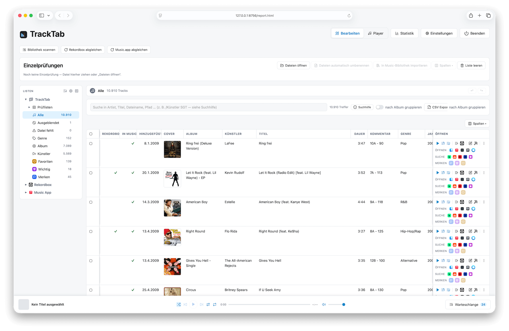

  *Die Bearbeiten-Ansicht.*

- **Player** — eine stark reduzierte Ansicht zum reinen Anhören: Bibliotheksverwaltung, Einzelprüfung und Export-Buttons sind ausgeblendet. Die Seitenleiste mit dem Listen-Baum bleibt vollständig sichtbar und bedienbar, und die gewählte Liste bleibt beim Umschalten stehen. In jeder Zeile bleiben nur Abspielen, Zur Warteschlange hinzufügen, „Musik öffnen" und Merken sichtbar. 


> [!tip] 
> Während ein Scan läuft, lässt sich nicht zur Player-Ansicht wechseln.

  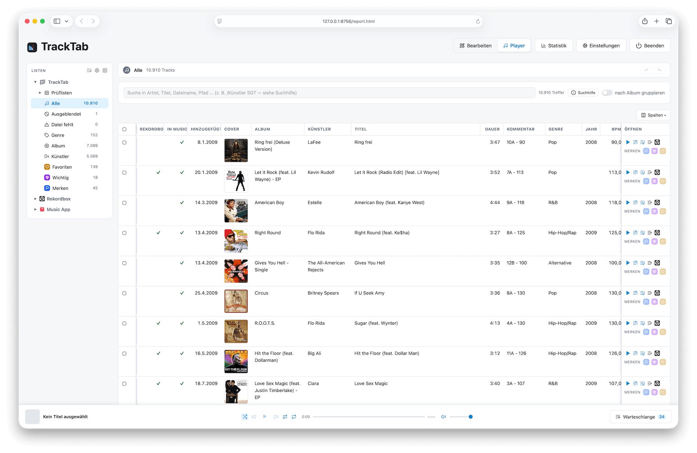

  *Die reduzierte Player-Ansicht.*

## Einstellungen

Unter dem Zahnrad-Symbol passt du Bibliothekspfade, Analyse-Empfindlichkeit, Klassengrenzen, externe Programme (Audio-Editor, DAW, Mixed In Key, Music App, Rekordbox) und weitere Optionen an. Jede Gruppe lässt sich einzeln auf die Vorgabe zurücksetzen.

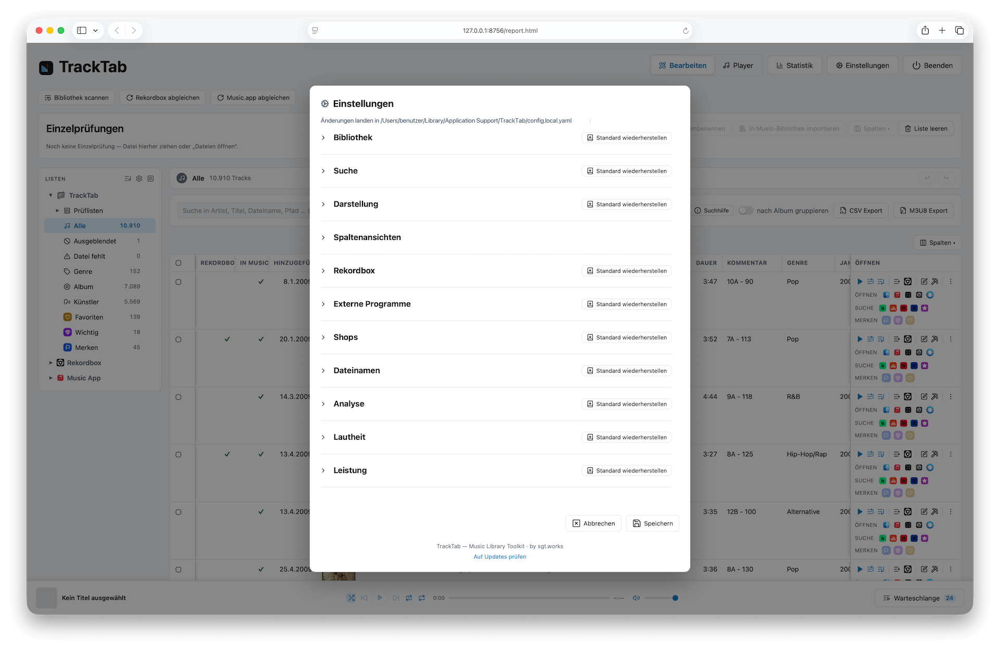

*Der Einstellungen-Dialog.*

Die zwölf Gruppen im Überblick:

| Gruppe | Was sich dort einstellen lässt |
|---|---|
| **Bibliothek** | Musikordner, Dateiendungen, ausgeschlossene Ordner, Mindestdauer |
| **Suche** | Tippfehler-Toleranz, Mindestzeichen für Autovervollständigung, Standard-Suchfilter (siehe [Suchen und filtern](#suchen-und-filtern)) |
| **Darstellung** | Sprache, Farbschema, Schriftgröße, Designfarbe |
| **Spaltenansichten** | Standard-Spaltenansicht für Listen ohne eigene Zuordnung (siehe [Spalten anpassen](#spalten-anpassen)) |
| **Rekordbox** | Rekordbox-App, Ziel-Playlist für den Schnellzugriff, Waveform-Stil (siehe [Bibliothek scannen](#bibliothek-scannen)) |
| **Externe Programme** | Audio-Editor, DAW, Mixed In Key, Music App, AAC-Encoder (siehe [Die Buttonleiste](#die-buttonleiste)) |
| **Shops** | Welche Plattformen als Such-Icons in der Buttonleiste erscheinen (siehe [Die Buttonleiste](#die-buttonleiste)) |
| **Dateinamen** | Namensmuster fürs automatische Umbenennen (siehe [Dateien automatisch umbenennen](#dateien-automatisch-umbenennen)) |
| **Analyse** | Cutoff- und Klassengrenzen je Format (siehe [Ist die Bitrate korrekt?](#ist-die-bitrate-korrekt)) |
| **Lautheit** | LUFS-Referenzbereich, True-Peak-Warnschwelle (siehe [Ist die Bitrate korrekt?](#ist-die-bitrate-korrekt)) |
| **Leistung** | Anzahl paralleler Analyse-Prozesse beim Scannen |

> [!tip]
> Ist unter „Externe Programme" die Music App ausgewählt, sollten in Music.app selbst (Einstellungen → Dateien) diese beiden Optionen aktiviert sein: „Medienordner automatisch verwalten" und „Beim Hinzufügen zur Mediathek Dateien in den Medienordner kopieren". Nur so legt Music.app importierte Dateien zuverlässig in seinem eigenen Medienordner ab, und TrackTab kann Pfadänderungen durch Music.app (Umbenennen, Umsortieren) automatisch nachvollziehen.
>
> 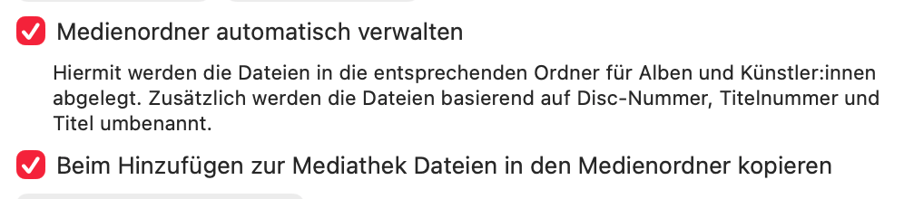

Unter den Button „Abbrechen“/„Speichern“ steht klein die laufende Versionsnummer sowie ein Link „Auf Updates prüfen“ — ein Klick vergleicht sie mit der neuesten auf GitHub veröffentlichten Version und meldet per Popup, ob eine neue Version verfügbar ist oder die Anwendung bereits aktuell ist.

---

## Ist die Bitrate korrekt?

Jede Datei bekommt ein **Verdikt**:

| Verdikt | Bedeutung |
|---|---|
| **Korrekt** | Unauffällig — die Qualität passt zur angegebenen Bitrate. |
| **VERDÄCHTIG** | Etwas stimmt nicht ganz — könnte ein Transcode sein, könnte aber auch ein bandbegrenztes Master oder ein alter Rip sein. Anhören lohnt sich. |
| **FAKE** | Sehr wahrscheinlich hochgerechnet — die Datei behauptet eine höhere Qualität, als sie tatsächlich hat. |
| **UNKLAR** | Zu kurz, zu leise oder aus einem anderen Grund nicht sicher beurteilbar. |

Dahinter steckt eine spektrale Analyse: Bei komprimierten Formaten (MP3, AAC) hinterlässt eine geringere Bitrate eine erkennbare Grenze in den hohen Frequenzen. Wurde eine Datei aus einer niedrigeren Bitrate hochgerechnet, bleibt diese Grenze auch nach dem Neukodieren sichtbar — auch wenn die Datei jetzt als 320 kbps deklariert ist. 

Bei verlustfreien Formaten (ALAC, FLAC, WAV, AIFF) gibt es keine deklarierte Bitrate zum Vergleich; hier zählt allein, ob überhaupt eine solche Grenze vorhanden ist — denn in einer wirklich verlustfreien Datei sollte keine sein.


## Bitrate korrigieren

Für Tracks mit dem Verdikt **VERDÄCHTIG** oder **FAKE** bietet TrackTab an, die Datei direkt auf eine niedrigere, ehrliche Bitrate neu zu kodieren — verfügbar bei verlustbehafteten Formaten (MP3, AAC), nicht bei verlustfreien Formaten.

Der Button „Bitrate korrigieren" erscheint an drei Stellen:

- **Als Symbol in der Zeile** eines betroffenen Tracks (Haupttabelle wie Einzelprüfung).
- **Als Sammelaktion** über der Auswahl mehrerer Zeilen in der Haupttabelle — jeder Track wird dabei auf seine eigene gemessene Bitrate korrigiert.
- **In den Einzelprüfungen als Sammelaktion**, dort aber nur aktiv, wenn genau ein betroffener Track ausgewählt ist.

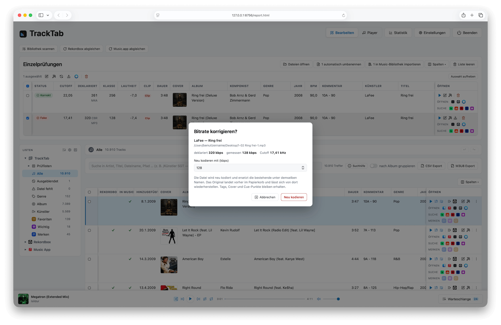

*Der Dialog „Bitrate korrigieren".*

Im sich öffnenden Dialog steht die gemessene Bitrate bereits als Vorschlag im Feld, lässt sich aber frei auf einen Wert zwischen 32 und 320 kbps ändern. Ein Klick auf „Neu kodieren" kodiert die Datei mit dieser Bitrate neu und ersetzt die bestehende Datei unter demselben Namen; das Original wandert vorher in den Papierkorb und lässt sich von dort wiederherstellen. Tags, Cover und Cue-Punkte (z. B. von Serato oder Rekordbox) bleiben dabei erhalten.

## Lautheit der Tracks

Zusätzlich misst TrackTab die **Lautheit** jeder Datei (nach dem in der Musikindustrie üblichen LUFS-Standard). Dafür gibt es kein Gut/Schlecht-Urteil, da die "richtige" Lautheit vom Musikgenre und Erscheinungsjahr abhängt — nur eine Warnung, wenn eine Datei technisch übersteuert ist (Clipping-Gefahr).

Die Schwellwerte können in den Einstellungen individuell angepasst werden. Nach anpassung der Schwellwerte muss die Bibliothek erneut gescannt werden.

Die genauen Schwellwerte, Formeln und die Kalibrierung dahinter stehen in den [Technischen Funktionen](technische_funktionen.md).

---

## Unterstützte Dateiformate

TrackTab liest, analysiert und taggt: **MP3, M4A/MP4 (AAC & ALAC), AAC, FLAC, WAV, AIFF/AIFC, ALAC, OGG/OGA, Opus, WMA**.

Für Bitraten-Analyse, Tags, Umbenennen, Konverter und Music.app-/Rekordbox-Abgleich spielt das Dateiformat keine Rolle — diese Funktionen laufen serverseitig über `ffmpeg`/`ffprobe`/`mutagen` und sind vom Browser unabhängig.

**Ausnahme ist das Anhören im eingebauten Player** (Wellenform, Warteschlange): Die Audiodatei wird dafür unverändert an den Browser gestreamt und dort per `<audio>`-Element abgespielt — welche Formate dabei tatsächlich zu hören sind, entscheidet ausschließlich die Decoder-Unterstützung des verwendeten Browsers, nicht TrackTab:

| Format | Safari | Chrome / Edge | Firefox |
| :--- | :---: | :---: | :---: |
| MP3 | ✅ | ✅ | ✅ |
| AAC / M4A | ✅ | ✅ | ✅ |
| ALAC (`.m4a`) | ✅ | ❌ | ❌ |
| WAV | ✅ | ✅ | ✅ |
| FLAC | ✅ | ✅ | ✅ |
| AIFF/AIFC | ✅ | ❌ | ❌ |
| OGG/Opus | teils¹ | ✅ | ✅ |
| WMA | ❌ | ❌ | ❌ |

¹ Ogg Vorbis wird von Safari nicht unterstützt, Opus erst in neueren Versionen.

Für die verlässlichste Wiedergabe aller unterstützten Formate empfiehlt sich daher **Safari** — insbesondere bei AIFF- oder ALAC-lastigen Bibliotheken. In Chrome/Firefox lassen sich solche Tracks zwar analysieren und bearbeiten, aber nicht im Player anhören (stummer/fehlerhafter Abspielversuch).

---

## Bibliothek scannen

**Scannen.** TrackTab durchsucht deine konfigurierten Musikordner und analysiert jede noch nicht bekannte oder seither geänderte Datei. Der Button „Bibliothek scannen" öffnet dafür die Scan-Optionen:

   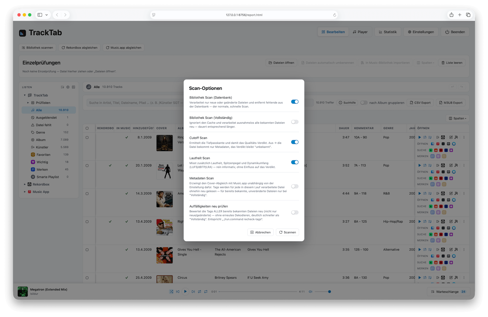

   *Der Scan-Optionen-Dialog.*

   - **Bibliothek Scan (Datenbank)** — der normale, schnelle Scan: verarbeitet nur neue oder geänderte Dateien und entfernt fehlende aus der Datenbank.
   - **Bibliothek Scan (Vollständig)** — ignoriert den Cache und verarbeitet ausnahmslos alle bekannten Dateien neu. Legt den Cache damit komplett neu an, dauert entsprechend länger und ist normalerweise nur nach Parameter-Änderungen an der Analyse nötig.
   - **Cutoff Scan** — ermittelt die Tiefpasskante und damit das Qualitäts-Verdikt. Abgeschaltet bekommt eine Datei nur Metadaten, das Verdikt bleibt „unbekannt".
   - **Lautheit Scan** — misst zusätzlich Lautheit, Spitzenpegel und Dynamikumfang (LUFS/dBTP/LRA), rein informativ und ohne Einfluss auf das Verdikt.
   - **Metadaten Scan** — erzwingt den Cover-Abgleich mit Music.app unabhängig von der sonstigen Einstellung dafür (nur bei ausgewählter Music App, siehe „Einstellungen").
   - **Auffälligkeiten neu prüfen** — bewertet die Tags ALLER bereits bekannten Dateien neu (nicht nur neue/geänderte), ohne die Datei erneut zu dekodieren — deutlich schneller als „Vollständig". Sinnvoll nach einem TrackTab-Update, wenn sich die Erkennung selbst verbessert hat (siehe [Auffälligkeiten (Metadaten-Probleme)](#auffälligkeiten-metadaten-probleme)).

## Rekordbox abgleichen

   **„Rekordbox abgleichen"** prüft, welche Tracks bereits in Rekordbox' Sammlung liegen, und sucht wahlweise nach Rekordbox-Einträgen, deren Datei fehlt, unter den eigenen Bibliothekspfaden wieder (mit Vorschau vor dem Schreiben).

   > [!tip] 
>Damit dieser Button angezeigt wird, muss in den Einstellungen "Rekordbox" als Programm ausgewählt sein.

## Music.app abgleichen
  
 **„Music.app abgleichen"** macht denselben Abgleich für die Music.app-Bibliothek. Beide Buttons erscheinen nur, wenn das jeweilige Programm in den Einstellungen ausgewählt ist.

 > [!tip] 
> Damit dieser Button angezeigt wird, muss in den Einstellungen "Music.app" als Programm ausgewählt sein.

## Der Mediaplayer

Am unteren Bildschirmrand sitzt ein fest angedockter Player — er ist in beiden Ansichten immer sichtbar, auch ohne laufende Wiedergabe. Er zeigt Cover, Titel und Interpret des aktuellen Tracks sowie:

- **Wiedergabe/Pause, Vorheriger/Nächster Titel** — auch über die Leertaste bzw. die Pfeiltasten ←/→ steuerbar. Ein langer Titel läuft beim Hovern in Ruhe durch, wenn er abgeschnitten ist.
- **Zufallswiedergabe** — spielt die Warteschlange in zufälliger statt fester Reihenfolge. Läuft gerade noch nichts, startet ein Klick darauf sofort einen zufälligen Track aus der aktuell gefilterten Ansicht.
- **Titel wiederholen** — der aktuelle Track startet nach seinem Ende erneut, statt zum nächsten zu springen.
- **Liste wiederholen** — nach dem letzten Track der Warteschlange geht es wieder von vorn los.

In der **Player-Ansicht** startet ein Klick auf eine Zeile oder deren Abspielen-Button sofort eine komplett neue Warteschlange aus den nächsten (bis zu 25) Tracks der aktuell angezeigten Liste, beginnend bei dieser Zeile — spätere Änderungen an Suche/Filter wirken sich nicht mehr auf eine schon laufende Warteschlange aus. 

In der **Bearbeiten-Ansicht** klappt ein Zeilenklick dagegen nur die Wellenform auf (siehe „Anhören mit Wellenform" weiter unten), ohne die Wiedergabe zu starten — das erledigt dort erst ein Klick auf den Abspielen-Button im Wellenform-Bereich oder auf das ▶-Symbol in der Öffnen-Spalte. Ab dann läuft derselbe Mediaplayer wie in der Player-Ansicht, inklusive automatischer Warteschlange.

Jede Zeile hat in beiden Ansichten drei Buttons hintereinander:

- **Abspielen** (▶) — startet wie oben beschrieben eine komplett neue Warteschlange (in der Bearbeiten-Ansicht klappt dabei zusätzlich die Wellenform auf).
- **Als nächstes abspielen** — reiht den Track direkt hinter dem gerade laufenden ein, er ist damit garantiert der nächste, ohne die laufende Wiedergabe zu unterbrechen.
- **Zur Warteschlange hinzufügen** (Linien-Plus-Symbol, dasselbe wie am Warteschlange-Button) — hängt den Track ans Ende der Warteschlange an.

Beide Hinzufügen-Buttons lassen sich beliebig oft auf denselben Track klicken — jeder Klick reiht ihn erneut ein, auch wenn er schon läuft oder gerade erst gespielt wurde. Eine so von Hand ergänzte Warteschlange ist nicht mehr auf 25 Titel begrenzt. Sind mehrere Zeilen per Checkbox ausgewählt, erscheint in der Sammelleiste derselbe „Hinzufügen"-Button für alle Ausgewählten auf einmal, daneben deine Merklisten.

Der Button „Warteschlange" öffnet ein Popup mit zwei Reitern:

- **Warteschlange** — der aktuelle Track (hervorgehoben) und alles, was als Nächstes kommt. Tracks lassen sich hier per Drag & Drop neu anordnen, über das ✕ entfernen oder per Klick direkt anspielen.

  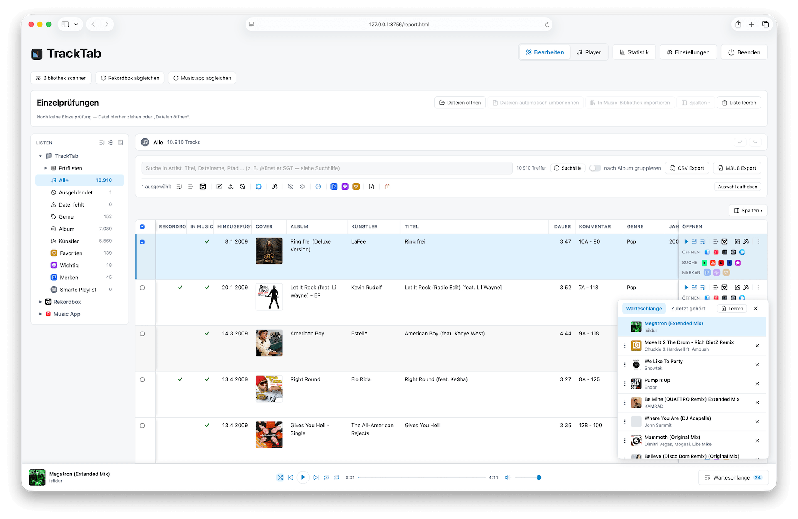

  *Das Warteschlange-Popup.*
- **Zuletzt gehört** — dein Hörverlauf, neuester Eintrag zuerst; die letzten 200 Titel werden behalten, ältere fallen hinten heraus. Ein Klick auf einen Eintrag spielt ihn erneut; der bisher laufende Track wandert dafür zurück an den Anfang der Warteschlange, statt verloren zu gehen. Einzelne Einträge lassen sich hier nicht entfernen, nur komplett über „Leeren".

„Leeren" oben im Popup leert Warteschlange und Verlauf komplett. Beides übersteht ein Neuladen der Seite (an der pausierten Stelle, ohne von selbst loszuspielen) — die **Vorheriger-Titel**-Taste (auch über die Pfeiltaste ←) greift dabei genau auf diesen Verlauf zurück.

Rechts neben dem Fortschrittsbalken sitzt ein Lautstärkeregler mit eigenem Stummschalten-Button — beide sind gekoppelt (Stummschalten zieht den Regler auf 0 und zurück, der Regler ganz nach links schaltet ebenfalls stumm) und werden über einen Neuladen hinweg gemerkt.

## Die Seitenleiste

Links steht der Listen-Baum. Er ist in der Breite verstellbar — fasse die Kante zwischen Leiste und Tabelle und zieh sie. Die Breite bleibt gespeichert. Der Baum ist in beiden Ansichten (Bearbeiten und Player) gleich, und die gewählte Liste bleibt beim Umschalten stehen.

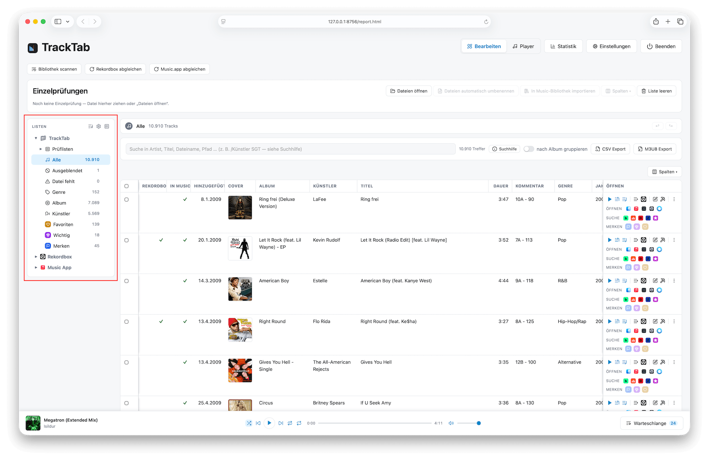

*Die drei Wurzeläste des Listen-Baums: TrackTab, Music App, Rekordbox.*

Es gibt drei Bereiche:

**📁 TrackTab** — deine eigene Datenbank. Ganz oben die festen Listen: 
**Alle**, **Ausgeblendet**, **Datei fehlt**, **Genre**, **Album**, **Künstler**, **Duplikate** und deine **Merklisten**. Darunter der feste Ordner **Prüflisten** mit je einer Liste pro Status, jede mit einem Punkt in ihrer Statusfarbe: ● Korrekt (grün), ● Verdächtig (orange), ● Fake (rot), ● Unklar (grau), ● Manuell korrigiert (blau) — dieselben Farben wie die Status-Abzeichen in der Tabelle. Ebenfalls im Ordner „Prüflisten": **Duplikate** und **Auffälligkeiten** (Metadaten-Probleme statt Audioqualität, siehe [Auffälligkeiten (Metadaten-Probleme)](#auffälligkeiten-metadaten-probleme) weiter unten).

 Diese Listen bringt TrackTab selbst mit und lassen sich nicht umbenennen, ändern oder löschen. **Verschieben lassen sie sich aber**: die Reihenfolge im Baum gehört dir. Darunter stehen die Playlisten, Ordner und Smart Playlists, die du selbst anlegst.

**🎵 Music App** und **🎛 Rekordbox** — die Playlisten dieser beiden Programme. Die Listen werden erst geladen, wenn du den Ast aufklappst, und sind **schreibgeschützt**: TrackTab zeigt sie an, ändert dort aber nichts. 

Jeder Ast erscheint nur, wenn das jeweilige Programm in den Einstellungen ausgewählt ist — ohne das bleibt der Ast ganz weg. Die beiden Äste selbst lassen sich wie deine eigenen Listen im Baum verschieben, TrackTab steht dabei aber immer an erster Stelle. 

> [!tip] 
> Sollte eine Fehlermeldung auftreten oder sich Daten in den verbundenen Tools geändert haben, können die Daten jederzeit neu geladen werden. Klicken Sie dazu auf die „…“ und wählen Sie „Neu laden“ aus.


Die Liste **Duplikate** zeigt Tracks, die es doppelt gibt — entweder als exakte Kopie oder als derselbe Song in unterschiedlicher Qualität (z. B. einmal als MP3, einmal als FLAC).

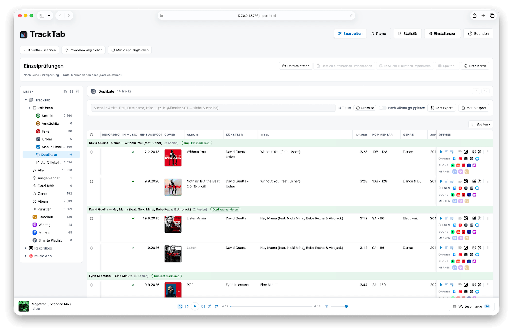

*Die Duplikate-Liste.*

## Playlisten und Ordner

Über die Buttons im Kopf der Seitenleiste legst du an:

- **+** eine Playlist
- **⚙** eine Smart Playlist (siehe unten)
- **📁** einen Ordner

Beim Anlegen wählst du Name, Symbol und Farbe. Ordner dürfen Ordner enthalten.

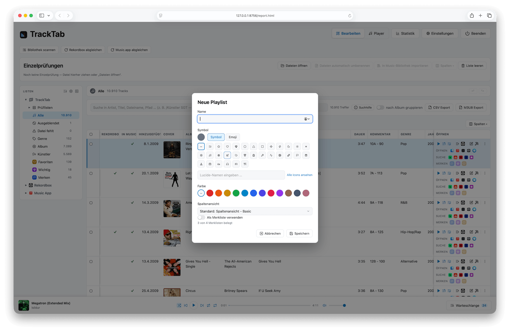

*Eine neue Playlist anlegen.*

**Tracks hineinlegen** geht auf drei Wegen: Zeilen aus der Tabelle in die Playlist ziehen (ist die gezogene Zeile Teil deiner Auswahl, wandert die ganze Auswahl mit), über „Zur Playlist hinzufügen …" im Zeilenmenü, oder über denselben Button in der Sammelleiste, wenn mehrere Zeilen ausgewählt sind.

**Reihenfolge der Tracks:** Innerhalb einer Playlist ziehst du Zeilen an ihren Platz. Das geht auch, während eine Spaltensortierung aktiv ist — beim Ablegen schaltet die Ansicht auf deine Reihenfolge zurück, damit du das Ergebnis siehst. Klickst du danach wieder auf einen Spaltenkopf, sortiert die Ansicht wie überall sonst; die selbst gelegte Reihenfolge bleibt gespeichert und kommt zurück, sobald du die Liste erneut öffnest.

**Reihenfolge im Baum:** Alles unter TrackTab lässt sich ziehen und neu anordnen — die festen Ansichten oben, der Ordner „Prüflisten" und die Listen darin ebenso wie deine eigenen. Ziehst du auf die obere oder untere Hälfte eines Eintrags, landet der gezogene davor bzw. dahinter; auf die Mitte eines Ordners, landet er darin.

**Rückgängig:** Über der Tabelle steht der Kopf der geöffneten Playlist mit ↩ und ↪. Sie nehmen Hinzufügen, Entfernen und Umsortieren zurück und wieder vor — auch per Cmd+Z und Cmd+Shift+Z. Der Verlauf gilt für die laufende Sitzung; nach einem Scan oder einem Neuladen beginnt er von vorn.

Über das **⋯**-Menü an jeder Liste, in drei durch Linien getrennte Gruppen: was die Liste selbst betrifft (Bearbeiten mit Name, Symbol und Farbe; bei Smart Playlists Regeln bearbeiten; Duplizieren) — was mit ihrem Inhalt geschieht (Zur Warteschlange, M3U8 exportieren) — und Löschen. Löschen entfernt nur die Liste — die Tracks selbst bleiben unangetastet. Bei einem Ordner verschwindet auch sein Inhalt, die Rückfrage sagt es dazu.

## Playlisten "Merken"

Bis zu vier eigene Playlisten lassen sich als Merkliste markieren — zum Beispiel „Neu kaufen", „Im Warenkorb" oder „Zeigen". Das geschieht im Bearbeiten-Dialog der Playlist (Rechtsklick → „Bearbeiten"): dort steht eine Checkbox „Als Merkliste verwenden", zusätzlich zum ohnehin vorhandenen Namen, Icon und Farbe der Playlist. Jede Zeile trägt dann ein farbiges Icon-Quadrat je markierter Playlist; ein Klick fügt den Track hinzu, ein erneuter Klick entfernt ihn wieder. Ein Track kann gleichzeitig in mehreren Merklisten stehen. Anders als beim Ausblenden bleiben gemerkte Tracks überall sichtbar, auch im Export — Merken ist eine reine Kennzeichnung, kein Filter. 

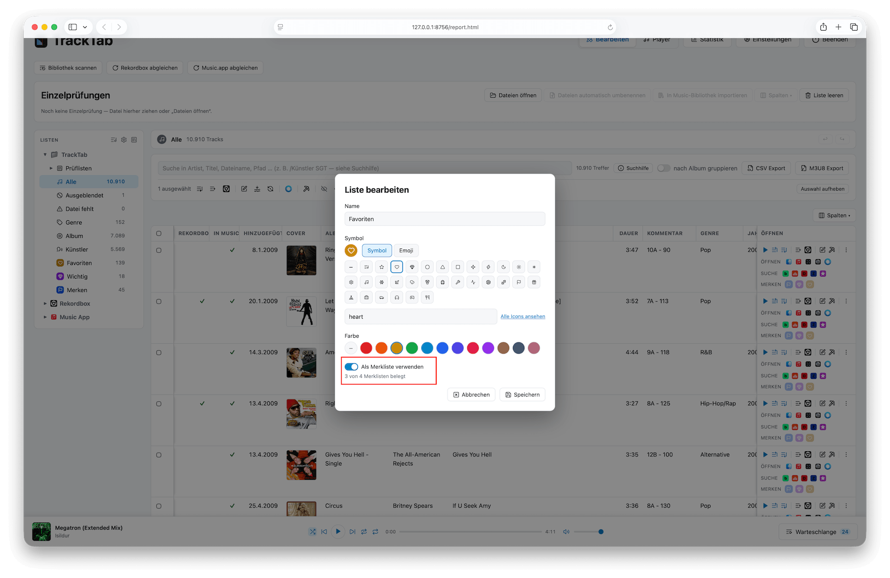
*Bis zu vier eigene Playlisten lassen sich als Merkliste markieren.*

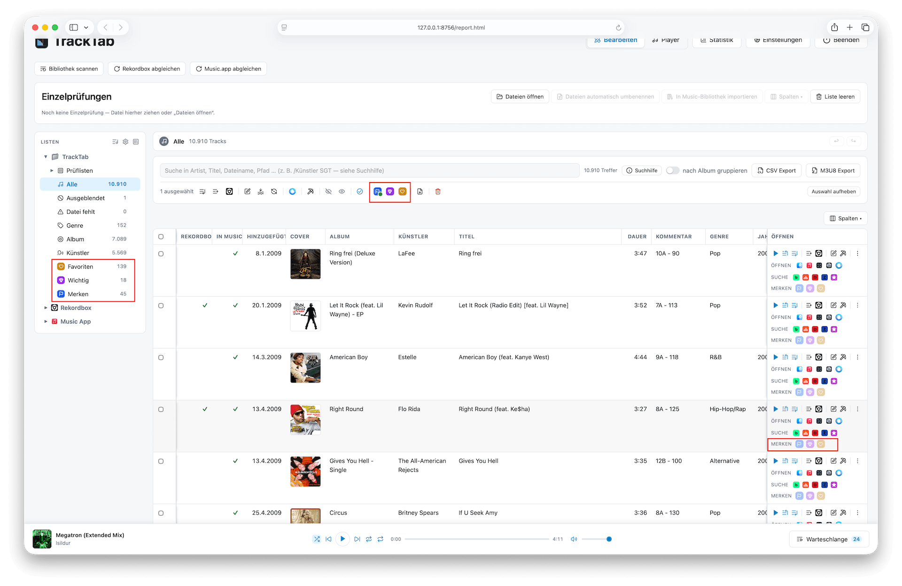
*Die Merklisten werden pro Track angezeigt und in der Mehrfachauswahl*

## Smart Playlists

Eine Smart Playlist hat keinen festen Inhalt, sondern Regeln. Im Regel-Editor legst du fest, ob **allen** oder **beliebigen** Regeln entsprochen werden muss, und baust die Zeilen mit **+** und **−** auf. Das Wertfeld richtet sich nach dem gewählten Feld: bei „Status" bekommst du die Verdikte zur Auswahl, bei „BPM" ein Zahlenfeld, bei „In Music.app" ja/nein.

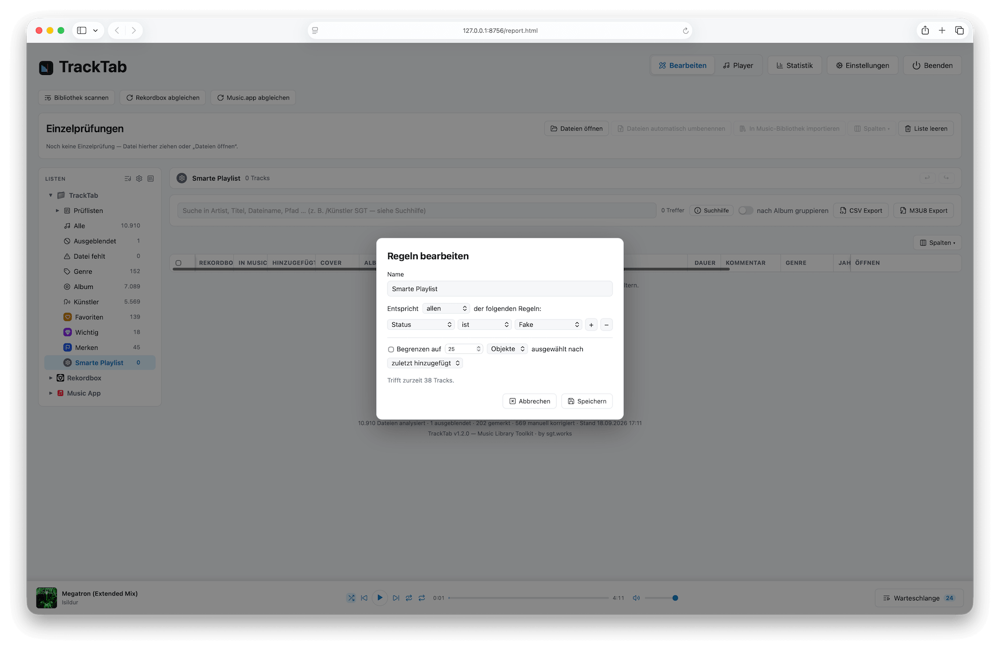

*Regeln einer Smart Playlist bearbeiten.*

In der Fußzeile begrenzt du die Liste auf eine Anzahl Objekte, eine Spielzeit oder eine Speichergröße — ausgewählt nach zuletzt hinzugefügt, niedrigstem Cutoff, Künstler oder Zufall. Unter dem Dialog steht laufend, wie viele Tracks die Regeln gerade treffen.

Berechnet wird beim Start des Programms und jedes Mal, wenn du die Liste im Baum anklickst — nicht dauernd im Hintergrund.

## Fremde Playlisten

Klappst du **Music App** oder **Rekordbox** auf, liest TrackTab deren Playlisten-Baum. Ein Klick auf eine Liste zeigt ihre Tracks in genau der Reihenfolge, die dort gilt.

Tracks, zu denen TrackTab keine Datei hat, stehen trotzdem an ihrer Stelle in der Liste — gedämpft und mit einem Hinweis: **keine lokale Datei** (ein Apple-Music-Track aus der Cloud) oder **nicht in TrackTab** (eine Datei außerhalb der gescannten Ordner). So bleibt die Reihenfolge nachvollziehbar, statt dass Lücken entstehen. Diese Zeilen zählen nirgends mit und lassen sich nicht abspielen oder bearbeiten.

Einzelne Rekordbox-Smart-Playlists verwenden Zeitregeln, die nur Rekordbox selbst auswerten kann. Sie erscheinen im Baum, ihr Inhalt bleibt aber leer — TrackTab sagt das beim Öffnen.

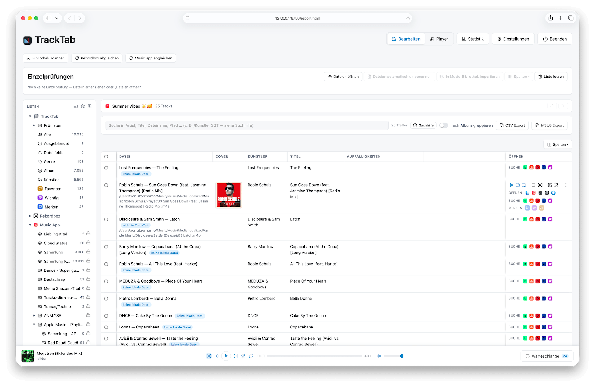

*z.B. Apple Musik Cloud Dateien werden in der Playlist angezeigt und sind mit "keine lokale Datei" markiert.*


## Suchen und filtern

Das Suchfeld über der Tabelle durchsucht standardmäßig Künstler, Titel und Pfad — und zwar tippfehlertolerant (wie stark, stellst du unter „⚙ Einstellungen → Suche" ein). Es kann aber deutlich mehr. Der Button **ⓘ Suchhilfe** listet jederzeit alle Parameter mit Beispielen auf.

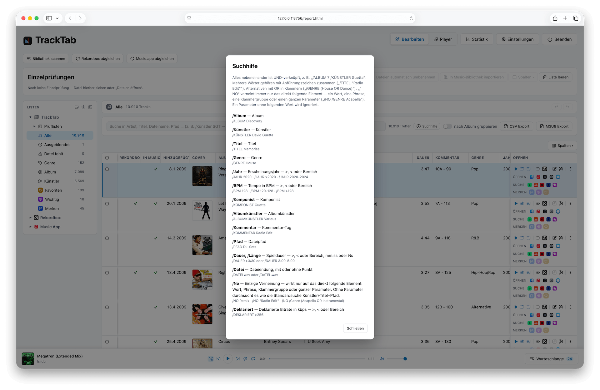

*Suche mit Parametern.*

**Alles, was nebeneinander steht, muss zutreffen (UND).**

| Du schreibst | Ergebnis |
|---|---|
| `guetta memories` | beide Wörter müssen vorkommen |
| `"radio edit"` | genau diese Wortfolge (Anführungszeichen = wortgetreu, keine Tippfehler-Toleranz) |
| `/Genre House` | nur im Genre suchen |
| `/Genre "Deep House"` | mehrwortige Werte gehören in Anführungszeichen |
| `/Genre (House OR Dance)` | eins von beidem genügt |
| `/Genre House /BPM 124-128` | beides zusammen |
| `/No Acapella` | schließt „Acapella" aus |
| `/No /Genre (Acapella OR Instrumental)` | schließt beide Genres aus |

**Wichtig bei mehreren Wörtern:** Ein Parameter nimmt immer nur das *nächste* Element. `/Genre Deep House` sucht also im Genre nach „Deep" und zusätzlich überall nach „House" — gemeint ist meist `/Genre "Deep House"`. Beim Auswählen eines Vorschlags aus der Liste setzt TrackTab die Anführungszeichen von selbst.

Genauso bei **`/No`**: Es verneint immer nur das direkt Folgende. `/No Acapella "David Guetta"` sucht nach „David Guetta" und schließt dabei „Acapella" aus.

**Zahlen und Datumsangaben** verstehen Vergleiche und Bereiche: `/BPM >128`, `/Jahr 2020-2024`, `/Dauer >3:30`, `/Deklariert >256`, `/Add >2026`.

**Ausgeblendete Tracks** erreichst du mit `/Ausgeblendet` — der Parameter braucht keinen Wert. Umgekehrt blendet `/No /Ausgeblendet` sie in jeder Liste aus. Und `/Status` grenzt auf ein Prüfergebnis ein (`/Status Fake`, `/Status verd`, `/No /Status Korrekt`); sobald du `/Status` getippt hast, erscheinen alle möglichen Werte zur Auswahl.

Jeder erkannte Parameter erscheint als **Chip** unter dem Suchfeld — ein Klick auf das × dort nimmt genau diesen Teil wieder aus der Suche heraus. Chips in anderer Farbe sind Standard-Suchfilter aus den Einstellungen: die gelten immer, lassen sich hier aber für die laufende Sitzung abschalten.

## Spalten anpassen

Jede Spalte lässt sich in der Breite ziehen und in der Reihenfolge verschieben (Überschrift greifen und ziehen). Über „Spalten ▾" blendest du weitere Informationen ein oder aus — z. B. Titel, Künstler, Cover, Album, Genre, Jahr oder BPM.

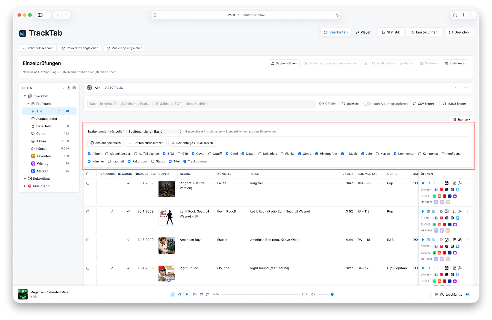

*Das Spalten-Menü.*

**Eine Ansicht speichern.** `Ansicht speichern` im Spalten-Menü legt die aktuelle Zusammenstellung — welche Spalten sichtbar sind, in welcher Reihenfolge und wie breit — unter einem Namen ab. Vergibst du einen Namen, den es schon gibt, wird diese Ansicht überschrieben; ein neuer Name legt eine neue an. Die gespeicherte Ansicht übernimmt sofort die gerade geöffnete Liste. Bis zu 20 Ansichten sind möglich.

**Eine Ansicht laden.** Das Auswahlfeld oben im Spalten-Menü bestimmt, welche gespeicherte Ansicht die gerade geöffnete Liste verwendet. Der erste Eintrag bedeutet „keine eigene" — die Liste nimmt dann die Standard-Spaltenansicht aus den Einstellungen.

**Die Standard-Spaltenansicht** legst du unter *Einstellungen → Spaltenansichten* fest: eine der gespeicherten Ansichten gilt damit für jede Liste ohne eigene Einstellung. Dort lassen sich Ansichten auch umbenennen und löschen; eine gelöschte Ansicht nimmt die Listen mit, die sie verwendet haben — die fallen auf den Standard zurück, an den Spalten selbst ändert sich nichts.

Ist dort keine Standard-Spaltenansicht gesetzt, gilt weiterhin das, was du zuletzt im Spalten-Menü eingestellt hast, ohne dass eine Ansicht geladen war — getrennt für Bearbeiten und Player (siehe oben). Sobald du eine gespeicherte Ansicht lädst, wirkt sie dagegen in beiden: sie ist nur ein Satz Spalten.

**Achtung:** Solange eine gespeicherte Ansicht geladen ist, ändert jedes Häkchen, jeder Zug an einer Spaltenbreite und jedes Verschieben einer Überschrift **diese Ansicht** — und damit jede andere Liste, die sie ebenfalls verwendet.

**Je Liste einstellen.** Jede Liste im Baum links — eigene Playlisten, Smart Playlisten, die festen Prüflisten, „Alle", „Ausgeblendet", „Datei fehlt", „Duplikate" und die Merklisten — hat einen eigenen „…"-Button mit dem Eintrag „Spaltenansicht …": ein Dialog mit genau diesem einen Feld. Alternativ geht es auch über „Spalten ▾", während die betreffende Liste gerade geöffnet ist — beide Wege ändern dieselbe Zuordnung.

## Die Buttonleiste

Jede Zeile trägt dieselben Symbole, in der Buttonleiste immer sichtbar:

| Icon | Aktion |
|---|---|
|  | Abspielen (klappt zusätzlich die Wellenform auf, siehe unten) |
|  | Als nächstes abspielen |
|  | Zur Warteschlange hinzufügen |
|  | Zu einer Playlist hinzufügen |
|  | Zu einer vorausgewählten Rekordbox-Playlist hinzufügen (nur sichtbar, wenn dafür eine Ziel-Playlist in den Einstellungen hinterlegt ist und Rekordbox ausgewählt ist) |
|  | Metadaten bearbeiten |
|  | Neu Analysieren (Cutoff, Lautheit etc.) |
|  | „Weitere Optionen": Bitrate korrigieren, Ausblenden (Fehlalarm), Korrigieren (manuell als richtig markieren), Löschen (Papierkorb) |


**Öffnen**

| Icon | Aktion |
|---|---|
|  | Datei im Finder zeigen |
|  | In Music.app öffnen (nur sichtbar, wenn die Music App in den Einstellungen ausgewählt ist) |
| 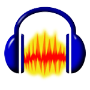 | Im externen Audio-Editor öffnen (z. B. iZotope RX, zum Gegenprüfen im Spektrogramm) Wird nur angezeigt wenn in den Einstellungen ein Editor ausgewählt ist. Das jeweilige Icon des Editors wird angezeigt. |
| 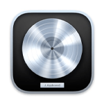 | In der eingestellten DAW öffnen (nur sichtbar, wenn eine hinterlegt ist). |
|  | In Mixed In Key öffnen (nur sichtbar, wenn eine hinterlegt ist). |

**Suche** (ein Icon je in den Einstellungen aktivierter Plattform)

| Icon | Aktion |
|---|---|
|  | Bei Beatport suchen |
|  | Bei SoundCloud suchen |
|  | Weitere, selbst konfigurierte Plattformen — Anfangsbuchstabe der Plattform in der gewählten Farbe |

**Merken**

| Icon | Aktion |
|---|---|
|  | Zu einer Merkliste hinzufügen/entfernen (Icon+Farbe je als Merkliste markierter Playlist) |

Alle Aktionen lassen sich auch auf eine Mehrfachauswahl anwenden (Checkboxen links in jeder Zeile) — die Sammelleiste zeigt dieselben Symbole für die ganze Auswahl auf einmal:

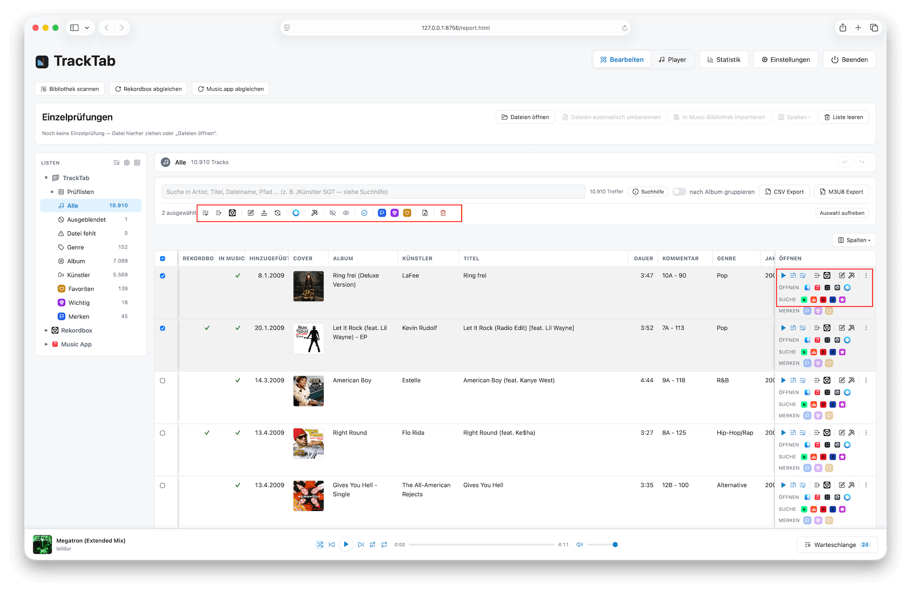

*Sammelleiste bei Mehrfachauswahl.*

Ein eigenes Symbol in der Sammelleiste (Datei mit Pfeil nach unten) exportiert die Auswahl als ZIP-Archiv. Ein Dialog fragt dabei, ob die Dateien innerhalb des Archivs nach dem Namensmuster aus den Einstellungen umbenannt werden sollen (Vorschlag vorausgefüllt, frei editierbar) — betrifft nur die Namen im ZIP, die Originaldateien in deiner Bibliothek bleiben unverändert.

## Anhören mit Wellenform

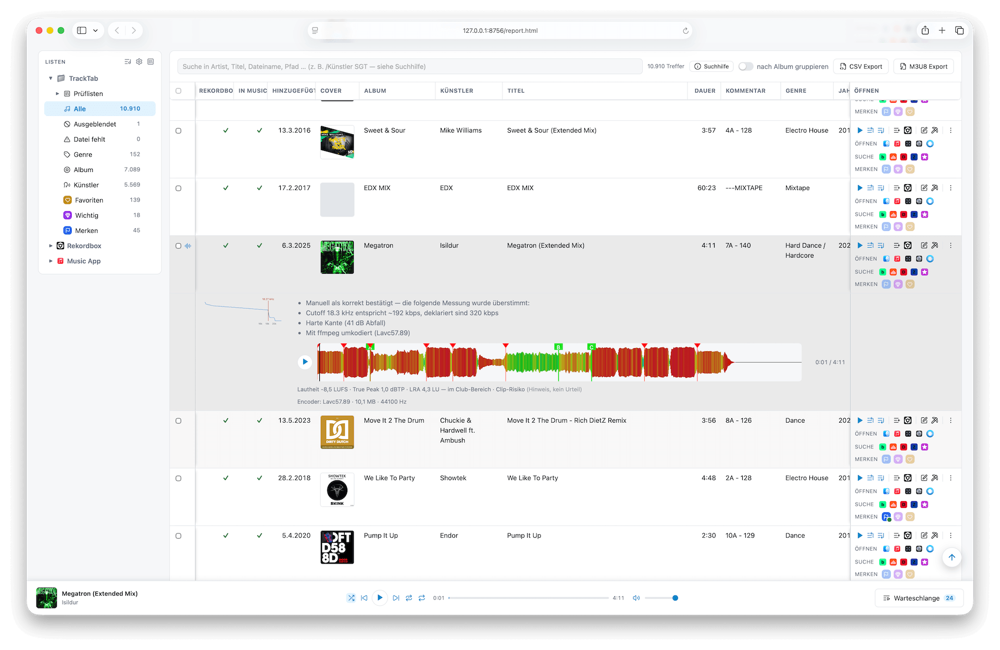

*Ausgeklappter Track mit Wellenform.*

Ein Klick auf eine Zeile in der Bearbeiten-Ansicht klappt sie auf und zeigt neben dem gemessenen Spektrum die Wellenform des Tracks — noch ohne zu spielen. Erst ein Klick auf den Abspielen-Button im Wellenform-Bereich (oder auf ▶ in der Öffnen-Spalte) startet die Wiedergabe über den Mediaplayer; die Wellenform zeigt danach live dessen Fortschritt (als farbige Linie), synchron zur Anzeige am unteren Bildschirmrand. 

Die Leertaste pausiert/startet die Wiedergabe, die Pfeiltasten ←/→ wechseln zum vorherigen/nächsten Track in der Warteschlange. In dieser aufgeklappten Ansicht steht außerdem ein Kopie-Symbol neben dem vollständigen Dateipfad, um ihn in die Zwischenablage zu kopieren.

Ist der Track bereits in Rekordbox analysiert, werden dessen Hot Cues und Memory Cues zusätzlich über der Wellenform eingeblendet; ein Klick auf einen Hot-Cue-Marker springt im Mediaplayer direkt dorthin, die Zifferntasten 1–8 tun bei aufgeklappter Wellenform dasselbe.

Liegt für den Track außerdem eine passende Rekordbox-Analysedatei vor, erscheint die Wellenform selbst farbig statt grau — in **RGB** oder **3-Band**, je nach der Einstellung „Waveform-Stil" unter Rekordbox. Mit „Standard" lässt sich dort auch bewusst bei der grauen Anzeige bleiben; ohne Rekordbox-Bezug ist Grau ohnehin die automatische Vorgabe.

Die Pfeiltasten ↑/↓ bewegen unabhängig davon eine Markierung zeilenweise durch die Tabelle — praktisch zum Durchblättern per Tastatur, ohne deine Checkbox-Auswahl für Sammelaktionen zu verändern. Läuft gerade ein Track, startet die Markierung bei dessen Zeile. Die Eingabetaste startet die Wiedergabe der markierten Zeile.

Welche Formate sich dabei tatsächlich hörbar abspielen lassen, hängt vom verwendeten Browser ab (AIFF und ALAC z. B. nur in Safari) — die vollständige Tabelle steht in der [README](readme.md#unterstützte-dateiformate). Analyse, Tags und Umbenennen sind davon nicht betroffen.

## Tags bearbeiten

Über das Stift-Symbol öffnest du einen Dialog für Titel, Interpret, Album, Albumkünstler, Komponist, Genre, Jahr, BPM, Cover und Kommentar. Änderungen werden direkt in die Datei geschrieben, unter demselben Namen am selben Ort. Beim Tippen schlägt das Feld bereits in der Bibliothek vorhandene Werte vor, damit keine Mehrfachschreibweisen entstehen (z. B. „Rock" und „rock").

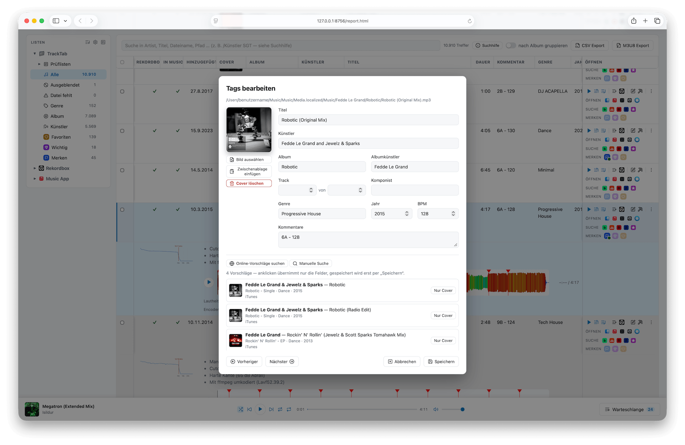

*Metadaten bearbeiten mit Online-Vorschlägen.*

Über „Online-Vorschläge suchen" lassen sich passende Metadaten (inkl. Cover) von iTunes, Deezer und MusicBrainz abrufen — ganz ohne Konto. Ein Klick auf einen Vorschlag füllt nur die Formularfelder; gespeichert wird erst durch den Klick auf „Speichern".

Sind mehrere Tracks ausgewählt, öffnet sich derselbe Dialog im Mehrfach-Modus: Nur die Felder, die du tatsächlich änderst, werden bei allen ausgewählten Dateien überschrieben.

## Auffälligkeiten (Metadaten-Probleme)

Neben der Frage „stimmt die Bitrate?" prüft TrackTab jede Datei zusätzlich auf **Metadaten-Probleme** — beschädigte oder unsauber gesetzte Tags, die zwar die Audioqualität nicht betreffen, aber z. B. beim Export als Playlist, beim Sortieren oder in anderen Programmen für Ärger sorgen können. Diese Auffälligkeiten sind eine eigene, von Korrekt/Verdächtig/Fake/Unklar **unabhängige** Kategorie: ein Track mit Verdikt „Korrekt" kann trotzdem Tag-Probleme haben, und umgekehrt.

Auslöser für diese Funktion war ein realer Fund: Ein Track hatte ein unsichtbares Zeilenumbruch-Zeichen mitten im Interpreten-Tag — dadurch wurde beim M3U8-Export aus einer Playlist-Zeile plötzlich zwei, und alle nachfolgenden Zeilen verschoben sich.

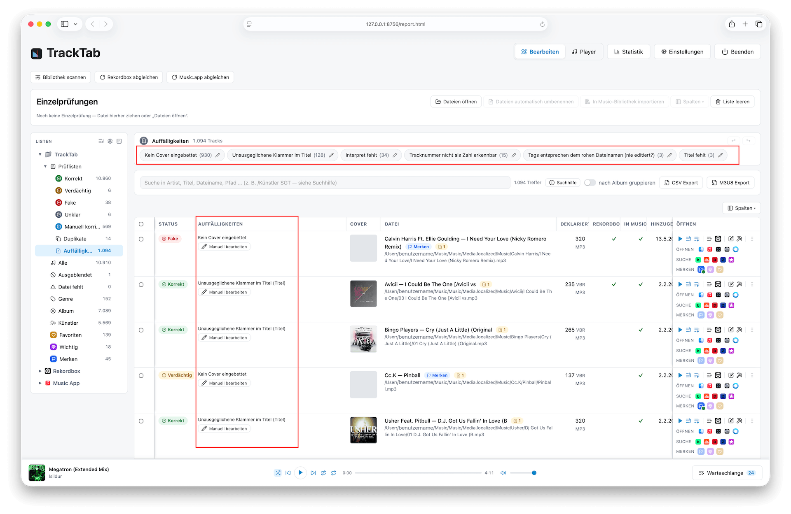
*Identifizierte Auffälligkeiten lassen sich in einer extra Spalte manuell oder je nach Problem automatisch bearbeiten.*


### Wo du sie findest

Die Liste **Auffälligkeiten** liegt in der Seitenleiste im Ordner **Prüflisten**, neben **Duplikate**. Im Kopf der Liste erscheint — genau wie bei Genre/Album/Künstler — eine Reihe **Bubbles**, eine je Fehlerart mit Anzahl betroffener Dateien:

- **Ein Klick auf eine Bubble** filtert die Tabelle auf genau diese Fehlerart.
- **Der Knopf daneben** (✨ oder ✎, siehe unten) bearbeitet **alle** Dateien mit genau diesem Fehler auf einmal.

Zusätzlich lässt sich über „Spalten ▾" eine eigene Spalte **Auffälligkeiten** einblenden, die in jeder Liste (nicht nur in „Auffälligkeiten" selbst) pro Zeile den Klartext jedes gefundenen Problems zeigt, direkt mit den beiden Aktionsknöpfen daneben. Und an jeder betroffenen Zeile erscheint neben dem Dateinamen ein kleines Warn-Symbol mit der Anzahl der Probleme — ein Klick darauf öffnet ein Popup mit denselben zwei Aktionen.

### Zwei Arten der Korrektur

Jedes gefundene Problem gehört zu einer von zwei Gruppen:

- **✨ Quick Fix** — eindeutig sicher behebbar, TrackTab korrigiert es auf Knopfdruck ohne Rückfrage zum Inhalt (nur eine Bestätigung, wie viele Dateien betroffen sind). Ein Quick Fix behebt bei einer Datei immer **alle** ihre sicher behebbaren Probleme auf einmal, nicht nur das eine angeklickte.
- **✎ Manuell bearbeiten** — erfordert eine Entscheidung, die nur du treffen kannst (z. B. welches Jahr korrekt ist). Der Knopf öffnet direkt den bekannten Tags-Dialog — bei einer einzelnen Zeile für genau diese Datei, bei einer Bubble im Sammel-Modus für alle betroffenen Dateien auf einmal.

### Die Fehlermeldungen im Einzelnen

| Auffälligkeit | Was das bedeutet | Korrektur |
|---|---|---|
| **Steuerzeichen/Zeilenumbruch im Tag** | Ein Tag-Wert (z. B. der Interpret) enthält ein unsichtbares Steuerzeichen oder einen Zeilenumbruch — sichtbar wird das erst beim Export (siehe oben) oder in manchen Fremdprogrammen. | ✨ Quick Fix |
| **Führendes/nachgestelltes Leerzeichen im Tag** | Ein Tag-Wert beginnt oder endet mit einem Leerzeichen — unsichtbar in der Tabelle, sorgt aber z. B. beim Sortieren oder Gruppieren für scheinbar doppelte Werte. | ✨ Quick Fix |
| **Nur ID3v1 vorhanden (kein ID3v2)** | Die Datei trägt nur das sehr alte, stark begrenzte ID3v1-Format (kurze Textfelder, kein Cover möglich). Moderne Programme lesen meist nur ID3v2. | ✨ Quick Fix |
| **Alter ID3v2.2-Header** | Die Datei nutzt die veraltete ID3v2.2-Variante — wird noch gelesen, aber von manchen Programmen nur eingeschränkt unterstützt. | ✨ Quick Fix |
| **Genre als unaufgelöster Zahlencode** | Das Genre-Feld enthält nur eine Zahl wie `(17)` statt Klartext — ein Überbleibsel aus der alten, festen ID3v1-Genreliste. TrackTab löst den Code automatisch in den passenden Namen auf (z. B. `(17)` → „Rock"). | ✨ Quick Fix |
| **Widersprüchliche Mehrfach-Tags** | Dasselbe Feld (z. B. Titel) ist mehrfach mit unterschiedlichem Inhalt in der Datei gespeichert — Programme können dann den falschen davon anzeigen. TrackTab führt sie auf einen Wert zusammen. | ✨ Quick Fix |
| **Tag nicht Unicode-normalisiert (NFC)** | Der Tag-Text ist technisch korrekt, aber in einer anderen Unicode-Normalform gespeichert als üblich (betrifft z. B. Umlaute) — kann beim Suchen/Sortieren zu scheinbar doppelten, eigentlich identischen Werten führen. | ✨ Quick Fix |
| **Encoding-Artefakt (falsch interpretierte Umlaute)** | Der Text sieht kaputt aus (z. B. „Björk" statt „Björk") — ein Zeichensatz wurde beim Taggen falsch interpretiert. TrackTab zeigt einen möglichen korrigierten Wert zur Vorschau, schreibt ihn aber nie ungefragt, da ein Fehlgriff hier eine Rateaufgabe wäre. | ✎ Manuell |
| **Unausgeglichene Klammer im Titel** | Der Titel enthält eine öffnende ohne passende schließende Klammer (oder umgekehrt) — meist ein abgeschnittener Titel wie „Song (Radio Edi". | ✎ Manuell |
| **Tags entsprechen dem rohen Dateinamen (nie editiert?)** | Interpret UND Titel sind identisch mit dem unbearbeiteten Dateinamen — ein Hinweis, dass die Tags nie gesetzt wurden. | ✎ Manuell |
| **Unplausibles Jahr** | Das Jahr-Feld enthält einen Wert, der kein echtes Erscheinungsjahr sein kann (z. B. vor 1900 oder in der Zukunft). | ✎ Manuell |
| **Tracknummer nicht als Zahl erkennbar** | Das Tracknummer-Feld enthält keinen gültigen Wert im Format „3" oder „3/12". | ✎ Manuell |
| **Titel fehlt** / **Interpret fehlt** | Eines der beiden Pflichtfelder ist komplett leer. | ✎ Manuell |
| **Kein Cover eingebettet** | Die Datei hat kein Cover-Bild. Tipp: Im Tags-Dialog lässt sich über „Online-Vorschläge suchen" oft passendes Cover-Material automatisch finden. | ✎ Manuell |
| **Cover ungewöhnlich groß** | Das eingebettete Cover ist deutlich größer als üblich (> 2 MB) — bläht die Datei unnötig auf. Quick Fix verkleinert es auf die übliche Kantenlänge von ca. 1000 Pixeln und komprimiert es neu als JPEG; das Seitenverhältnis bleibt erhalten. | ✨ Quick Fix |
| **Cover-Bilddaten beschädigt** | Die eingebetteten Bilddaten lassen sich nicht als Bild öffnen. | ✎ Manuell |
| **Dateiendung passt nicht zum tatsächlichen Codec** | Die Datei heißt z. B. `.mp3`, enthält aber tatsächlich AAC-Audiodaten — kann bei manchen Programmen zu Wiedergabeproblemen führen. | ✎ Manuell |

### Erneute Prüfung

Wie beim Qualitäts-Verdikt gilt: Eine Auffälligkeit wird bei jeder Art von Analyse neu geprüft — beim regulären Scan, bei „Track neu analysieren", bei den Einzelprüfungen und nach einer Bitrate-Korrektur. Wurde nur die **Erkennung selbst** verbessert (z. B. nach einem TrackTab-Update), ohne dass sich an den Dateien etwas geändert hat, genügt der Schalter „Auffälligkeiten neu prüfen" beim Scannen (siehe [Bibliothek scannen](#bibliothek-scannen)) — deutlich schneller als ein vollständiger Rescan, weil dabei nur die Tags neu gelesen werden, nicht die Audiodaten.

## Konverter MP3, AIFF

Ist mindestens ein Track ausgewählt (Haupttabelle oder Einzelprüfung), erscheint in der Buttonleiste ein zusätzliches Symbol für den Konverter. Ein Popup lässt dich das Zielformat wählen:

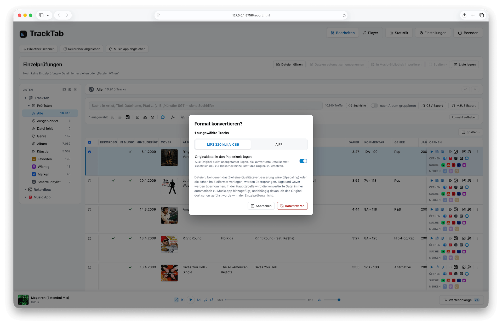

*Der Konverter mit Zielformat-Auswahl.*

- **MP3 320 kbit/s CBR** — konstante Bitrate, maximale Encoder-Qualitätsstufe, Samplerate der Quelle.
- **AIFF** — verlustfrei, Samplerate und Bittiefe der Quelle bleiben erhalten.

TrackTab verhindert dabei „Hochrechnen": eine Datei, die schon verlustbehaftet ist, lässt sich nicht zu AIFF konvertieren, und eine MP3 mit weniger als 320 kbit/s nicht zu 320 kbit/s hochkodieren. Solche Tracks werden übersprungen, ebenso Dateien, die bereits genau im Zielformat vorliegen (nichts zu gewinnen). Am Ende zeigt ein Bericht, wie viele Dateien konvertiert und wie viele aus welchem Grund übersprungen wurden.

Tags und Cover werden aus der Originaldatei übernommen. In der Haupttabelle wird die konvertierte Datei **immer automatisch in deine Music.app-Bibliothek aufgenommen** — unabhängig davon, ob das Original dort bereits geführt wurde oder nicht (Music.app hat keine Funktion zum „Ersetzen", ein bereits vorhandener Track wird beim Ersetzen deshalb entfernt und die konvertierte Datei neu importiert, siehe unten). In der Einzelprüfung passiert das **nicht** — dort hat TrackTab ohnehin keine Datenbankzeile und rührt Music.app nicht an.

Ein Schalter im Popup, „Originaldatei in den Papierkorb legen", bestimmt, was mit dem Original geschieht (standardmäßig an):

- **Aktiviert (Standard):** Das Original wandert nach erfolgreicher Konvertierung in den Papierkorb (nie Hard-Delete) — die neue Datei trägt denselben Namen mit neuer Endung, im selben Ordner, und ersetzt den Track in der Liste. War der Track bereits in Music.app, wird er dort zuerst entfernt (dabei können Playlist-Zugehörigkeiten in Music.app verloren gehen), dann die konvertierte Datei importiert. War er in Rekordbox bekannt, wird der Dateipfad dort korrigiert, sofern Rekordbox beim Konvertieren geschlossen ist.
- **Deaktiviert:** Das Original bleibt unangetastet liegen (Datei, Bibliothekseintrag und Music.app-Verknüpfung), die konvertierte Datei entsteht zusätzlich daneben und erscheint als eigener, neuer Eintrag in der Liste (bzw. in den Einzelprüfungen) — und wird ebenfalls neu in Music.app importiert. Rekordbox bleibt in diesem Fall unangetastet.

## Einzelprüfung von neuen Dateien (nicht in der Mediathek)

Für eine Datei, die noch nicht in der Bibliothek liegt, gibt es zwei unterschiedliche Wege — beide landen **nicht** in der Datenbank und beeinflussen weder Statistik noch Export, unterscheiden sich aber deutlich im Funktionsumfang:

- **Drag & Drop** — ziehst du eine Audiodatei auf die Seite, wird sie sofort gemessen und angezeigt: eine reine Schnellanalyse. In der Zeile stehen dafür nur eingeschränkte Aktionen zur Verfügung (Abspielen, Löschen, Shop-Suche).
- **„Dateien öffnen"** — der Button über den Einzelprüfungen öffnet einen Dateiauswahl-Dialog. Nur auf diesem Weg erhältst du den vollen Funktionsumfang: Metadaten bearbeiten, neu messen, konvertieren, automatisch umbenennen und — über „In Music-Bibliothek importieren" — den Track anschließend in deine Music.app-Bibliothek aufnehmen (der Button erscheint nur, wenn die Music App in den Einstellungen ausgewählt ist); TrackTab übernimmt den neuen Speicherort automatisch.

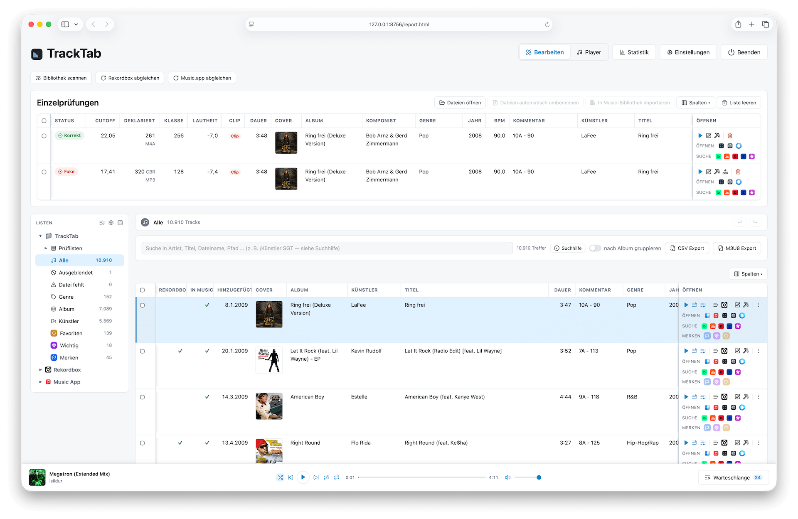

*Über „Dateien öffnen" hinzugefügt: voller Funktionsumfang.*

Der Unterschied auf einen Blick — dieselbe Datei einmal per Drag & Drop (eingeschränkte Aktionen), einmal über „Dateien öffnen" (volle Aktionsleiste):

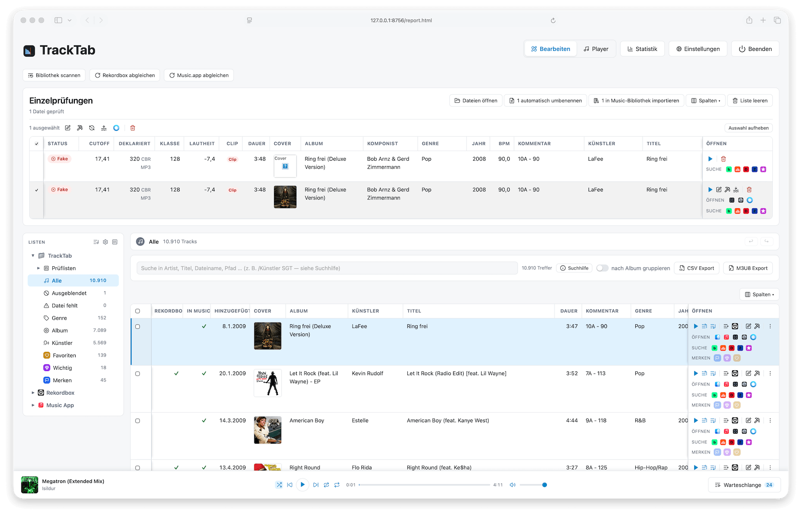

*Drag & Drop (unten) im Vergleich zu „Dateien öffnen" (oben).*

## Dateien automatisch umbenennen

Frisch gekaufte Tracks kommen je nach Shop mit sehr unterschiedlichen Dateinamen — die Metadaten in der Datei sind dagegen einheitlich. Der Button „Dateien automatisch umbenennen" in den Einzelprüfungen baut daraus einen einheitlichen Namen, für alle gerade ausgewählten Zeilen auf einmal.

Das Muster legst du in den Einstellungen unter **Dateinamen → Namensmuster** fest. Vorgabe:

```
{artist}_{title}_{bpm}_{key}_{bitrate}_{year}
```

Verfügbare Platzhalter: `{artist}`, `{title}`, `{album}`, `{albumartist}`, `{composer}`, `{genre}`, `{bpm}`, `{key}`, `{bitrate}`, `{year}`, `{samplerate}`, `{track}`.

So werden die Namen gebaut:

- **Unterstrich** trennt die Kategorien, **Bindestrich** die Wörter innerhalb einer Kategorie: `daft-punk_get-lucky_116bpm_8a_320kbps_2013.mp3`
- Alles klein geschrieben, Umlaute ausgeschrieben (ä → ae), Sonderzeichen werden zu Bindestrichen.
- Ein Platzhalter ohne Wert lässt seine Kategorie **ersatzlos entfallen** — es bleibt keine Lücke zurück. Bei verlustfreien Formaten (FLAC, WAV, AIFF, ALAC) gibt es keine aussagekräftige Bitrate, dort fällt `{bitrate}` also automatisch weg: `bicep_glue_130bpm_4a_2017.flac`
- Die Tonart `{key}` liest TrackTab aus der Datei — sie steht dort, wenn Mixed In Key den Track analysiert hat.
- Existiert der Zielname schon, wird `-2`, `-3` … angehängt; die Dateiendung bleibt erhalten, der Ordner ebenfalls (es wird nichts verschoben).

Übersprungen wird:

- **Dateien, die schon in einem deiner Bibliotheksordner liegen.** Dort sind sie über ihren Pfad verknüpft (Music.app, Rekordbox, Playlisten) — ein neuer Name würde diese Verweise zerreißen.
- **Dateien ohne Interpret und Titel.** Ein Name aus lauter technischen Werten (`320kbps.mp3`) sagt weniger aus als der vorhandene Dateiname.
- Dateien, die bereits genau so heißen.

Ein Fortschritts-Hinweis zeigt an, wie weit das Umbenennen ist; am Ende steht, wie viele Dateien umbenannt und wie viele aus welchem Grund übersprungen wurden. Die Zuordnung in TrackTab wird dabei sofort mitgezogen — Abspielen, Metadaten bearbeiten, neu messen und der Import funktionieren direkt weiter, ohne die Dateien erneut öffnen zu müssen.

## Statistik

Der Button „Statistik" in der Kopfzeile zeigt eine Jahres-/Monats-Auswertung: wie viele Aktionen (Korrekturen, Konvertierungen, Tag-Änderungen, Cover, Papierkorb, Umbenennungen, Rekordbox-/Music.app-Abgleich, …) in welchem Monat passiert sind, wie viel insgesamt gehört wurde, und welche Titel, Interpreten und Genres am meisten Wiedergabezeit hatten. Ein Jahres-Dropdown wechselt zwischen den Jahren, für die es Daten gibt; „Neu berechnen" aktualisiert die Zahlen sofort. Bei den meistgehörten Titeln legt „Playlist aus Top 50 erstellen" eine neue Playlist mit den bis zu 50 meistgehörten Titeln des gewählten Jahres an.

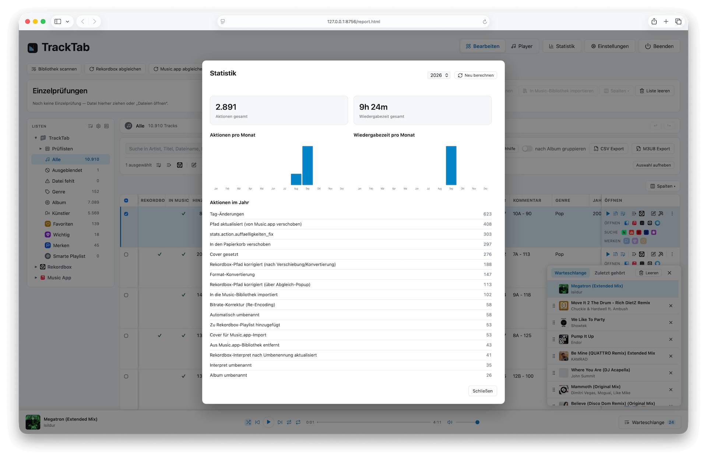

Ist Rekordbox in den Einstellungen ausgewählt, wird die Historie aus Rekordbox geladen und man erhält ebenfalls eine Statistik.


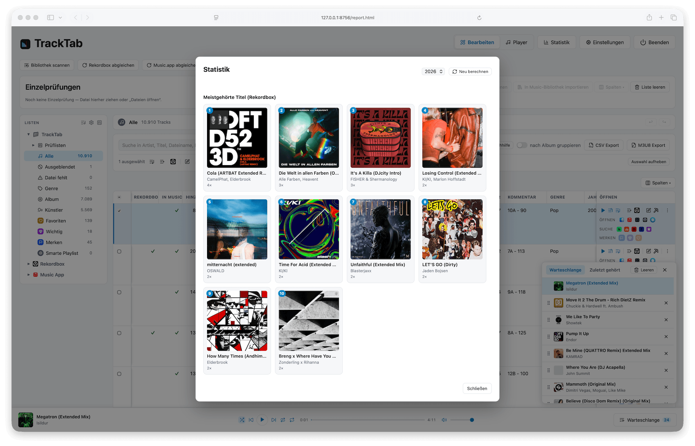


*Das Statistik-Dashboard.*

## Genre, Album, Künstler + Korrekturvorschläge

In der Seitenleiste liegt je eine Liste für Genre, Album und Künstler (dazu „Duplikate", siehe unten) — jede zeigt die komplette Bibliothek gruppiert nach dem jeweiligen Wert, mit eigener Spaltenansicht, Warteschlange und Export wie jede andere Liste. Im Kopf der Liste erscheint eine Reihe mit allen vorkommenden Werten als Bubbles (Anzahl in Klammern); ein „ausklappen"-Link darunter vergrößert die Reihe bei vielen Werten. Das Stift-Symbol an einer Bubble oder an einer Gruppenüberschrift in der Tabelle öffnet denselben Umbenennen-Dialog und benennt den Wert für ALLE betroffenen Tracks auf einmal um — geschrieben wird in die Datei-Tags selbst sowie, sofern zutreffend, in den Music.app-Import und in Rekordbox, damit alle drei Orte im Gleichschritt bleiben. Läuft Rekordbox gerade, wird die Übernahme dort übersprungen (die Meldung weist darauf hin); die Änderung an Datei und Datenbank erfolgt trotzdem. Bei Album ist zusätzlich der Künstler festgelegt, damit zwei gleichnamige Alben verschiedener Künstler nie versehentlich vermischt werden.

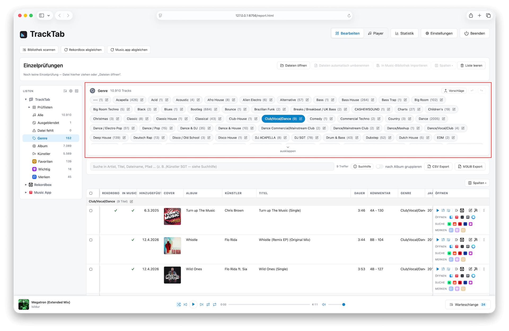
*Alle Genres werden als Bubble angezeigt, mit der Anzahl der betroffenen Tracks in Klammern. Mit Klick auf eine Bubble wird dieser als Filter für die Liste angewendet.*

Der Button „Vorschläge" blendet automatisch erkannte, vermutlich zusammengehörige Werte ein (unnötiges Leerzeichen, Groß-/Kleinschreibung, möglicher Tippfehler, mögliche Variante wie Single/Remix) — jeweils mit Grund und einem Augen-Symbol, das die betroffenen Tracks vorab in der Tabelle zeigt, bevor etwas geändert wird. „Ziel auswählen" öffnet einen Dialog, in dem sich einer der beiden Werte als Ergebnis bestimmen lässt (unsichtbarer Leerraum wird dabei farblich hervorgehoben); „×" blendet einen Vorschlag dauerhaft aus.

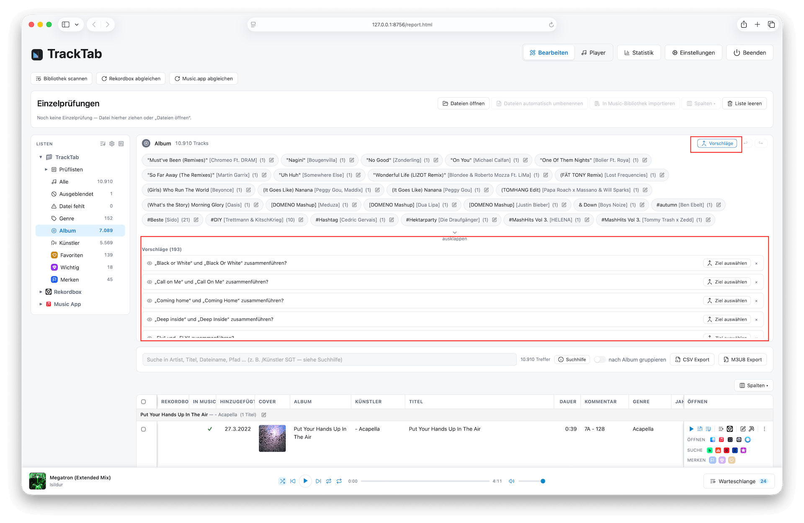
**Vorschläge werden angezeigt und können einzeln behoben werden.**

## Tracks ausblenden

Das Augen-Symbol markiert einen Track als Fehlalarm — er verschwindet aus den Kennzahlen und dem Export. Über „Ausgeblendete zeigen" holst du ihn zur Kontrolle zurück; nichts geht dabei verloren, die Datei selbst wird nie angefasst.

## Gelöschte und verschobene Dateien

Löschst du eine Datei außerhalb von TrackTab, bleibt ihr Eintrag zunächst als „Datei fehlt" stehen; ein Button räumt solche Einträge auf. Verschiebt oder benennt Music.app eine Datei nach einer Tag-Änderung eigenständig um, erkennt TrackTab das automatisch wieder und verknüpft den Eintrag neu.

## Verwaiste Ordner

Ein Button in den Einstellungen findet leere Ordner in deinen Musikordnern (z. B. Reste nach dem Löschen von Tracks in Music.app) und verschiebt sie nach Rückfrage in den Papierkorb.

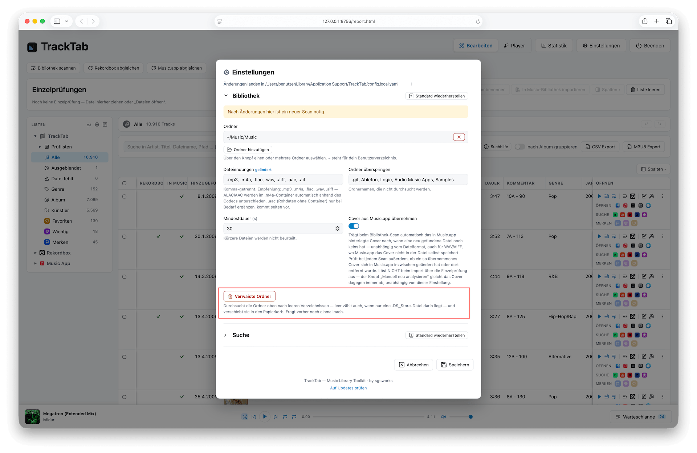
**Verweiste Ordner löschen.**

## Backup

Beim Beenden von TrackTab wird automatisch ein Backup deiner Analysedaten erstellt; ältere Backups werden nach einer konfigurierbaren Anzahl automatisch entfernt. Über die Einstellungen lässt sich jederzeit manuell ein Backup erstellen oder ein früherer Stand wiederhergestellt werden. Betroffen sind nur die Analysedaten von TrackTab selbst — deine Musikdateien fasst das Backup nicht an.

> **Trotzdem gilt:** TrackTab kann deine Musikdateien bearbeiten, umbenennen, umkodieren oder in den Papierkorb verschieben. Sichere deine Musikbibliothek regelmäßig und unabhängig von TrackTab, damit im Zweifel immer ein früherer Stand verfügbar ist.

---

## Grenzen

- Ein niedriger Cutoff-Wert kann auch von einem bandbegrenzten Master, einem Vinyl-Rip oder einer alten Aufnahme stammen — TrackTab liefert eine Prüfliste, kein Urteil.
- Die Erkennung bei AAC-Dateien ist noch nicht so ausgereift wie bei MP3.
- 224 kbps und 256 kbps lassen sich nicht voneinander unterscheiden.
- Der Papierkorb lässt sich nicht aus TrackTab heraus leeren — das bleibt bewusst dem Finder überlassen.
- Die Wiedergabe im Player hängt vom Browser ab: AIFF und ALAC spielen zuverlässig nur in Safari (siehe [README](readme.md#unterstützte-dateiformate)).
- Tag-Änderungen aktualisieren Music.app nicht sofort — der Import zeigt dort weiter die alten Metadaten, bis Music.app sie selbst neu einliest.
- Online-Metadatenvorschläge liefern selten ein BPM.
