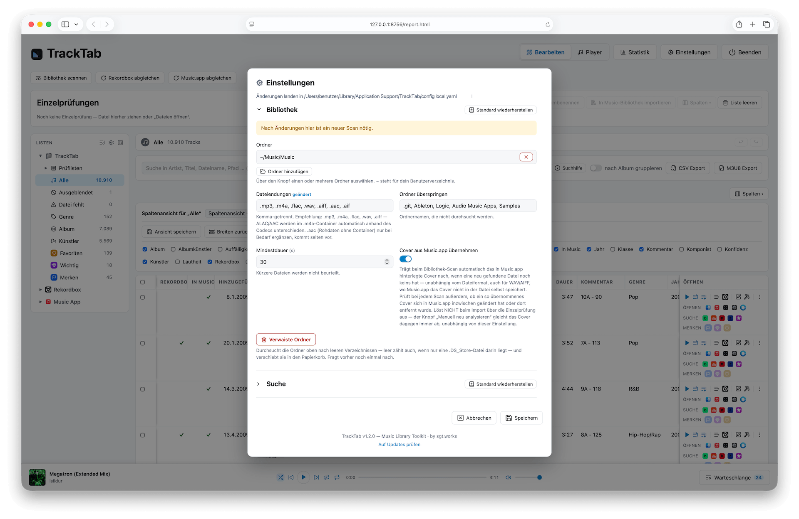
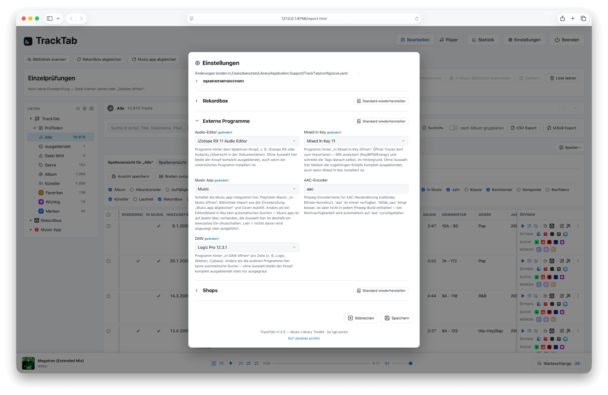
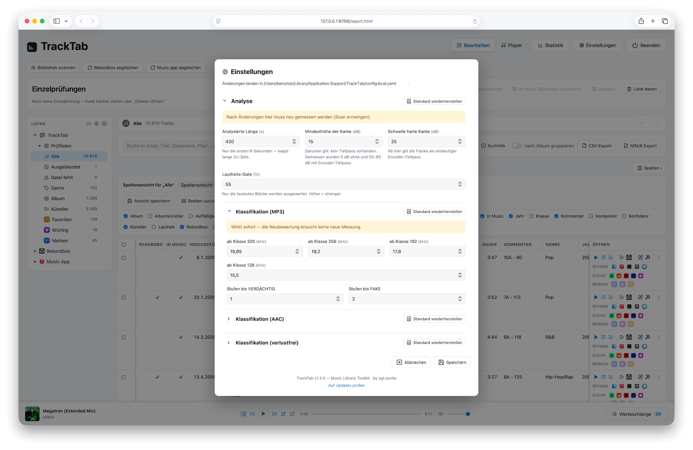
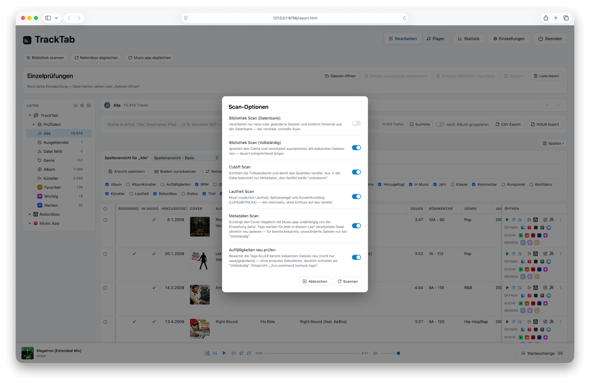

# Schnellstart

Die fünf Schritte vom Download bis zur ersten geprüften Bibliothek. Details zu jedem Schritt stehen im [Handbuch](handbuch.md) bzw. in [installation.md](installation.md).

---

## 1. Installieren

Wähle einen der drei Wege — die fertige App ist der einfachste Einstieg, ganz ohne Terminal:

- **Fertige App (.dmg)** — [installation.md](installation.md#1-installation-via-dmg-datei-macos)
- **Eigener App-Build** — [installation.md](installation.md#2-eigener-app-build-kompilierung-aus-dem-quellcode)
- **Terminal** — [installation.md](installation.md#3-ausführung--betrieb-über-das-terminal)

## 2. Starten & Einstellungen

Beim ersten Start ist die Bibliothek noch leer. Öffne unter dem Zahnrad-Symbol die [Einstellungen](handbuch.md#einstellungen) und lege mindestens fest:

- **Bibliothek** — deine Musikordner (Gruppe „Bibliothek").

- **Externe Programme** — falls du Music.app und/oder Rekordbox nutzt: hier auswählen, damit TrackTab beide abgleichen und Buttons dafür anzeigen kann. Nutzt du Music.app, aktiviere dort zusätzlich „Medienordner automatisch verwalten" und „Beim Hinzufügen zur Mediathek Dateien in den Medienordner kopieren" (Details im [Handbuch](handbuch.md#einstellungen)).

## 3. Verdikt, Lautheit etc. anpassen oder Standard belassen

Die Analyse-Schwellwerte (Cutoff-/Klassengrenzen, LUFS-Referenzbereich) sind ab Werk sinnvoll kalibriert — für den Einstieg reicht es, sie unangetastet zu lassen. Wer will, passt sie in den Gruppen **Analyse** und **Lautheit** an; siehe [Ist die Bitrate korrekt?](handbuch.md#ist-die-bitrate-korrekt) und [Lautheit der Tracks](handbuch.md#lautheit-der-tracks). Änderungen hier wirken erst nach einem erneuten Scan.

## 4. Bibliothek scannen

Der Button „Bibliothek scannen" analysiert alle noch nicht bekannten oder seither geänderten Dateien in den konfigurierten Musikordnern. Details zu den Scan-Optionen: [Bibliothek scannen](handbuch.md#bibliothek-scannen).

## 5. Loslegen

Ergebnis ist eine Prüfliste, kein Urteil — nach dem Scan siehst du in den festen **Prüflisten** die Tracks je Verdikt (Korrekt/Verdächtig/Fake/Unklar). Von hier aus:

- Auffällige Tracks anhören und einordnen — siehe [Ist die Bitrate korrekt?](handbuch.md#ist-die-bitrate-korrekt) und [Anhören mit Wellenform](handbuch.md#anhören-mit-wellenform).
- Falsche Treffer [ausblenden](handbuch.md#tracks-ausblenden) oder [manuell korrigieren](handbuch.md#die-buttonleiste).
- Verlustbehaftete Tracks direkt [auf eine ehrliche Bitrate umkodieren](handbuch.md#bitrate-korrigieren).

Für alles Weitere (Playlisten, Tags bearbeiten, Konverter, Statistik, …) ist das [Handbuch](handbuch.md) die vollständige Referenz.
