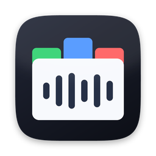

  

<h1 align="center">
  TrackTab — Music Library Toolkit by sgt.works
</h1>

  
  
  

  <b>Das Tool analysiert und korrigiert Bitraten, bearbeitet ID3-Tags und bietet eine Rekordbox-Anbindung inklusive Auto-Relocate sowie Hot-Cue-Anzeige. Zudem umfasst es eine Duplikatsuche, einen MP3- und AIFF-Konverter, Merk-, Play- und Smart-Playlists, Statistiken, ein Genre-, Album- und Künstler-Clean-up sowie einen Mediaplayer.</b>

## Warum TrackTab?
Apple Music, ID3-Tag-Editor, Mixed In Key und Rekordbox – die Pflege meiner Musiksammlung glich einem ständigen App-Wechsel. Das Ergebnis: Fehler, verlorene Dateipfade und keine Transparenz darüber, was eigentlich schon in Rekordbox gelandet war.

Deshalb habe ich mit Claude.ai TrackTab entwickelt. TrackTab hat zahlreichen Features um neue Tracks zu analysieren, die Qualität zu prüfen, sauber umzubenennen und die Bibliothek aktuell und ordentlich zu halten.

TrackTab ist flexibel – ob mit oder ohne Apple-Music.app, Rekordbox oder Mixed in Key - kann es jeden Unterstützen der seine Musiksammlung verwalten möchte. 

## Wie funktioniert TrackTab?
TrackTab läuft vollständig auf deinem Rechner im Browser deiner Wahl (vorzugsweise Safari) und benötigt keine Internetverbindung. Es kann sowohl mit als auch ohne die Apple Music App, Rekordbox oder Mixed In Key verwendet werden.
___

## Screenshot

*Übersicht der Bearbeiten-Ansicht mit Prüfliste.*

*Ausgeklappter Track mit Wellenform.*

*Metadaten bearbeiten mit Online-Vorschlägen.*

Weitere Screenshots zu allen Funktionen im [Handbuch](handbuch.md).

---

## Funktionen

| Funktion | Beschreibung & Details |
| :--- | :--- |
| **Bitraten Analyse** | Spektrale Cutoff-Analyse (MP3, M4A, FLAC, WAV, AIFF). Diese deckt hochgerechnete/transcodierte Dateien auf. Analyseergebnisse sind filterbar nach **Fake**, **Verdächtig**, **Korrekt**    Direktes Umkodieren auf die gemessene Bitrate oder manuelles eingeben der gewünschten Bitrate möglich   *Wichtig: Das Ergebnis ist eine Prüfliste, kein Urteil. Ein niedriger Cutoff kann auch von einem bandbegrenzten Master, einem Vinyl-Rip oder einer alten Aufnahme stammen.*  → [Details im Handbuch](handbuch.md#wie-die-prüfung-funktioniert-kurz-erklärt) · [Screenshot: Prüfliste](docs/009-pruefliste-tracks.png) · [Screenshot: Bitrate korrigieren](docs/018-bitrate-korrigieren.png) |
| Apple Music / iTunes | Zeigt pro Track an, ob er bereits in der Music.app-Bibliothek geführt wird. |
| Rekordbox | Zeigt pro Track an, ob er bereits in der [Rekordbox](https://rekordbox.com/de/)-Bibliothek vorhanden ist. Ein eigener Abgleich („Rekordbox abgleichen") aktualisiert dieses Zeichen und findet verschobene Dateien wieder.  → [Details im Handbuch](handbuch.md#bibliothek-scannen) · [Screenshot](docs/010-rekordbox-scan.png) |
| **Waveform zum Anhören** | Stellt die Waveform der Datei an. Enthält Hot- und Memory-Cues aus Rekordbox (falls vorhanden), und zeigt die Waveform selbst farbig (RGB oder 3-Band, einstellbar) statt grau, wenn der Track in Rekordbox analysiert ist.   Zifferntasten **1–8** springen zu Hot Cue A–H. Cues werden nur angezeigt, nicht editiert (Bearbeitung bleibt Rekordbox vorbehalten).  → [Details im Handbuch](handbuch.md#anhören-mit-wellenform) · [Screenshot](docs/005-waveform.png) |
| **Konverter** | Wandelt ausgewählte Tracks (auch mehrere gebündelt) nach MP3 320 kbit/s CBR oder AIFF (verlustfrei, Bittiefe der Quelle bleibt erhalten). Verhindert "Hochrechnen": eine bereits verlustbehaftete Datei lässt sich nicht zu AIFF konvertieren, eine MP3 unter 320 kbit/s nicht zu 320 kbit/s hochkodieren — solche Tracks werden übersprungen und am Ende gemeldet. Tags und Cover werden übernommen, die konvertierte Datei wird in der Haupttabelle immer automatisch zu Music.app hinzugefügt (unabhängig davon, ob das Original dort schon war — in der Einzelprüfung nicht). Ein Schalter im Popup bestimmt, ob das Original danach in den Papierkorb wandert und dabei in Music.app/Rekordbox ersetzt wird (Standard), oder ob es unangetastet liegen bleibt und die konvertierte Datei stattdessen als eigener, zusätzlicher Track zur Bibliothek hinzukommt.  → [Details im Handbuch](handbuch.md#konverter) · [Screenshot](docs/011-konverter.png) |
| **Metadaten bearbeiten** | Titel, Interpret, Album, Albumkünstler, Komponist, Genre, Jahr, BPM, Kommentar und Cover lassen sich direkt in der Audiodatei bearbeiten.   Über einen Klick können anhand des Dateinamens passende Online-Vorschläge von iTunes, Deezer und MusicBrainz abgerufen und übernommen werden. Alternativ ist auch eine manuelle Suche möglich.  Die Änderungen werden direkt in die Datei geschrieben und anschließend mit der Music.app-Mediathek synchronisiert.  → [Details im Handbuch](handbuch.md#tags-bearbeiten) · [Screenshot](docs/006-metadaten-edit.png) |
| **Metadaten-Mehrfachbearbeitung** | Mehrere Tracks auf einmal taggen (analog zur Funktionsweise der Music.app).  → [Details im Handbuch](handbuch.md#tags-bearbeiten) |
| **Dateien automatisch umbenennen** | Baut aus den Metadaten einen einheitlichen Dateinamen nach frei konfigurierbarem Muster (Vorgabe `{artist}_{title}_{bpm}_{key}_{bitrate}_{year}` → `daft-punk_get-lucky_116bpm_8a_320kbps_2013.mp3`). Unterstrich trennt die Kategorien, Bindestrich die Wörter darin; ein Platzhalter ohne Wert lässt seine Kategorie ersatzlos entfallen — bei verlustfreien Formaten also die Bitrate.   Gedacht für frisch gekaufte Tracks: umbenannt wird ausschließlich, was noch **nicht** in einem der Bibliotheksordner liegt. Die Zuordnung in TrackTab wird sofort mitgezogen, die Tracks bleiben also ohne Umweg weiter bearbeitbar.  → [Details im Handbuch](handbuch.md#dateien-automatisch-umbenennen) |
| **Schnellzugriff per Icon**  | Schnellaktionen lassen sich in den Einstellungen individuell festlegen. Die hinterlegten Programme werden anschließend mit ihrem jeweiligen Icon bei jedem Track angezeigt:  • In [Mixed In Key](https://mixedinkey.com/) öffnen  • Im [Audio-Editor öffnen](technische_funktionen.md#im-audio-editor-öffnen) (z. B. [iZotope RX](https://www.izotope.com/products/rx-advanced), [Audacity](https://www.audacityteam.org/) ) • In der eingestellten DAW öffnen (z. B. [Logic](https://www.apple.com/de/logic-pro/), [Abelton](https://www.ableton.com/de/) – nur sichtbar, wenn konfiguriert) • Zu einer vorausgewählten Rekordbox-Playlist hinzufügen • Der ausgewählte Track wird direkt auf den hinterlegten Plattformen gesucht. Standardmäßig stehen Beatport, SoundCloud, DJ City und Zip DJ zur Verfügung. Weitere Plattformen können jederzeit in den Einstellungen hinzugefügt werden.  → [Details im Handbuch](handbuch.md#die-knopfleiste) |
| **Duplikate finden** | Identifiziert doppelte Tracks anhand des gleichen Datei-Hashes oder der Kombination aus *Interpret + Titel + Dauer* (z. B. derselbe Song einmal als MP3 und einmal als FLAC).  → [Details im Handbuch](handbuch.md#die-seitenleiste) · [Screenshot](docs/014-duplikate.png) |
| **Playlisten & Ordner** | Seitenleiste mit Listen-Baum, in der Breite verstellbar und in beiden Ansichten gleich. Eigene Playlisten und verschachtelte Ordner, Tracks per Drag & Drop oder über einen Auswahldialog hinein, freie Reihenfolge per Ziehen, Rückgängig/Wiederherstellen je Playlist (auch Cmd+Z), Duplizieren, Warteschlange und M3U8-Export je Liste.  → [Details im Handbuch](handbuch.md#playlisten-und-ordner) · [Screenshot](docs/015-neue-plalist.png) |
| **Status-Listen** | Für jeden Status (Korrekt, Verdächtig, Fake, Unklar, Manuell korrigiert) bringt TrackTab eine feste, schreibgeschützte Liste im Ordner „Prüflisten" mit. Innerhalb jeder beliebigen Liste lässt sich der Status zusätzlich über den Suchparameter `/Status` eingrenzen.  → [Details im Handbuch](handbuch.md#die-seitenleiste) |
| **Auffälligkeiten (Metadaten-Probleme)** | Eigene, vom Qualitäts-Verdikt unabhängige Prüfung auf beschädigte/unsaubere Tags — z. B. Steuerzeichen im Interpreten-Feld, alte ID3-Versionen, unaufgelöste Genre-Codes, fehlendes Cover oder kaputte Umlaute. Eindeutig sichere Fälle lassen sich per „Quick Fix" auf Knopfdruck beheben (einzeln, für alle Dateien mit demselben Fehler auf einmal, oder als eigene Spalte), uneindeutige Fälle springen direkt in den Tags-Dialog.  → [Details im Handbuch](handbuch.md#auffälligkeiten-metadaten-probleme) |
| **Smart Playlists** | Regelbasierte Listen nach dem Vorbild von Apple Music: „entspricht allen/beliebigen" Regeln über Status, Format, Cutoff, BPM, Jahr, Lautheit, Dateigröße, Music.app- und Rekordbox-Präsenz und mehr, mit Begrenzung auf Anzahl, Spielzeit oder Speichergröße. Berechnet beim Start und beim Anklicken der Liste, mit Live-Vorschau im Regel-Editor.  → [Details im Handbuch](handbuch.md#smart-playlists) · [Screenshot](docs/007-playlist-smart-regeln.png) |
| **Fremde Playlisten lesen** | Playlisten-Bäume aus Music.app und Rekordbox werden im selben Baum angezeigt (schreibgeschützt, Ordner und Smart Playlists inklusive). Tracks, zu denen TrackTab keine Datei hat — Apple-Music-Cloud-Titel oder Dateien außerhalb der gescannten Ordner — stehen an ihrer Stelle in der Liste und sind als solche gekennzeichnet.  → [Details im Handbuch](handbuch.md#fremde-playlisten) · [Screenshot](docs/021-playlisten-baum.png) |
| **Merken** | Bis zu 4 eigene Playlisten lassen sich als Merkliste markieren (z. B. „Neu kaufen“, „Im Warenkorb“, "Zu Bearbeiten") zum Kennzeichnen von Tracks. Ein Track kann gleichzeitig in mehreren Merklisten stehen – unabhängig von Status wie *Ausgeblendet* oder *Manuell korrigiert*.  → [Details im Handbuch](handbuch.md#merken) |
| **Globale Suche & Kategorien** | Durchsucht die gesamte Bibliothek mit gezielter Eingrenzung über Kategorien und Filter.  → [Details im Handbuch](handbuch.md#suchen-und-filtern) · [Screenshot](docs/016-suchparameter.png) |
| **Ansichten: Bearbeiten & Player** | Umschaltbar zwischen der vollständigen Bearbeiten-Ansicht und einer reduzierten Player-Ansicht fürs reine Anhören. Der Listen-Baum bleibt in beiden Ansichten vollständig bedienbar und behält seine Auswahl. Ein fixer Mediaplayer (Play/Pause, Vor/Zurück, Zufallswiedergabe, Titel-/Listen-Wiederholung, Warteschlange per Drag & Drop) läuft ansichtsübergreifend weiter, inklusive Wellenform-Anzeige mit Hot-Cue-Sprüngen in der Bearbeiten-Ansicht. Spalteneinstellungen werden je Ansicht getrennt gespeichert.  → [Details im Handbuch](handbuch.md#ansichten-bearbeiten-und-player) · [Screenshot: Player-Ansicht](docs/001-player-view.png) · [Screenshot: Warteschlange](docs/012-warteschlange.png) |
| **Spaltenansichten** | Sichtbare Spalten, ihre Reihenfolge und ihre Breite lassen sich unter eigenen Namen speichern und einzelnen Listen zuordnen — jeder Playlist, aber auch „Alle", „Ausgeblendet", den Prüflisten oder den Merklisten. Welche Ansicht für alle übrigen Listen gilt, steht als Standard-Spaltenansicht in den Einstellungen.  → [Details im Handbuch](handbuch.md#spalten-anpassen) |
| **Deutsch & Englisch** | Die Oberfläche ist auf Deutsch und Englisch verfügbar. Die Sprache lässt sich in den Einstellungen unter „Darstellung" fest wählen oder auf „Automatisch" stellen – dann folgt TrackTab der Spracheinstellung deines Browsers. Ist diese weder Deutsch noch Englisch, wird Deutsch angezeigt.  → [Details im Handbuch](handbuch.md#einstellungen) |
| **Playlists exportieren** | Export in den Formaten **CSV** und **M3U8** aus ganzen Listen, Filterungen oder einzelnen Tracks — sowie je Playlist über deren Menü.  → [Details im Handbuch](handbuch.md#playlisten-und-ordner) |
| **Verwaiste Ordner finden & löschen** | Durchsucht die konfigurierte Bibliotheksordner nach leeren Verzeichnissen (zählt auch als leer, wenn nur eine `.DS_Store`-Datei vorhanden ist) und verschiebt diese nach Rückfrage in den Papierkorb.  → [Details im Handbuch](handbuch.md#verwaiste-ordner) |
| **Backup** | Nach jedem Beenden des Tools wird automatisch ein Backup der Bibliothek in einem separaten Ordner erstellt. Sobald mehr als 10 Backu   Vor jedem Schreibvorgang in die Rekordbox-Bibliothek wird zusätzlich geprüft, ob Rekordbox geöffnet ist. Ist die Anwendung geschlossen, wird vor dem Schreibvorgang automatisch ein weiteres Backup erstellt. Auch hierbei wird die Anzahl der Backups auf 10 Dateien begrenzt.  → [Details im Handbuch](handbuch.md#backup) |
| **Log** | Protokolliert jede durchgeführte Bearbeitung lückenlos in einer Log-Datei pro Tag. |
| **Statistik** | Jahres-/Monats-Auswertung aus dem Log und der tatsächlichen Hörzeit: Aktionen pro Monat, Gesamt-Wiedergabezeit sowie meistgehörte Titel, Interpreten und Genres. Aus den meistgehörten Titeln lässt sich direkt eine Playlist mit den Top 50 eines Jahres erstellen.  → [Details im Handbuch](handbuch.md#statistik) · [Screenshot](docs/013-statistik.png) |
| **Aufräumen** | Eigener Seitenleisten-Ordner mit Listen für Genre, Album und Künstler, gruppiert nach dem jeweiligen Wert, samt Bubble-Übersicht und automatischen Zusammenführungs-Vorschlägen (Leerzeichen, Groß-/Kleinschreibung, Tippfehler, Varianten). Ein Wert lässt sich für alle betroffenen Tracks auf einmal umbenennen — geschrieben wird in die Datei-Tags sowie, sofern zutreffend, in Music.app und Rekordbox, damit alle drei Orte im Gleichschritt bleiben.  → [Details im Handbuch](handbuch.md#aufräumen-genre-album-künstler) |

---

## Weiterführende Dokumentation

- **QuickStart** (So startest du in nur 5 Schritten): [quickstart.md](quickstart.md)
- **Handbuch** (reine Bedienungsanleitung ohne technische Details): [handbuch.md](handbuch.md)
- **Installation** (fertige App, eigener Build, Terminal): [installation.md](installation.md)
- **Technische Funktionen** (Referenz für Weiterentwicklung: Algorithmen, Formeln, Architektur): [technische_funktionen.md](technische_funktionen.md)
- **Änderungshistorie**: [changelog.md](changelog.md)
- **Aktuelles Release** (Download der `.dmg`): [GitHub Releases](https://github.com/sebssch/TrackTab/releases/latest)

## Unterstützen

Dieses Projekt hat unzählige Arbeitsstunden und eine jede Menge an Tokens (Claude.ai) verschlungen.

Gefällt dir TrackTab? Dann würde ich mich über eine kleine Spende freuen: [paypal.me/SGabler](https://paypal.me/SGabler)

## Lizenz

MIT — siehe [LICENSE](LICENSE). © 2026 Sebastian Gabler (sgt.works)

Die Icons der Web-UI stammen aus dem [Lucide](https://lucide.dev/icons/)-Set (ISC-Lizenz), lokal
vendort in `app/webui/lucide-icons.js`.
